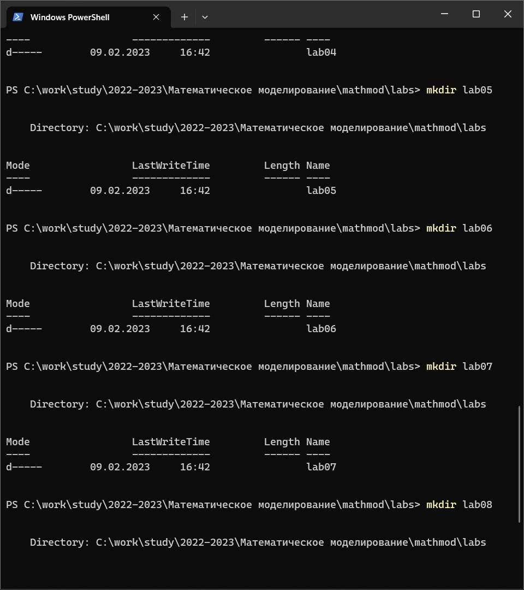
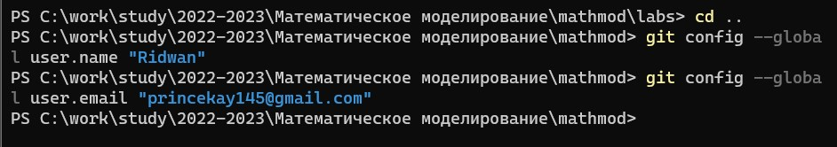
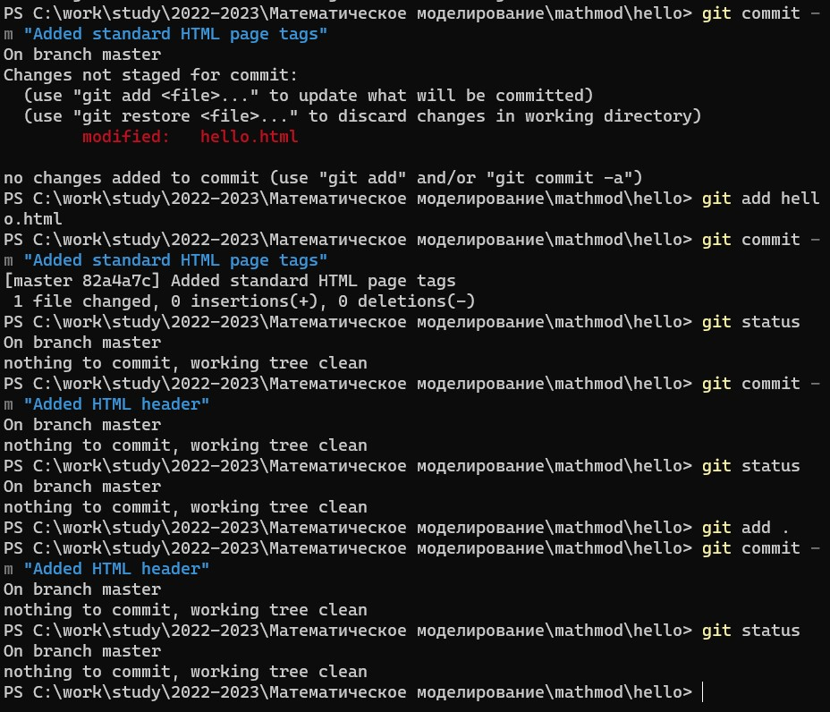
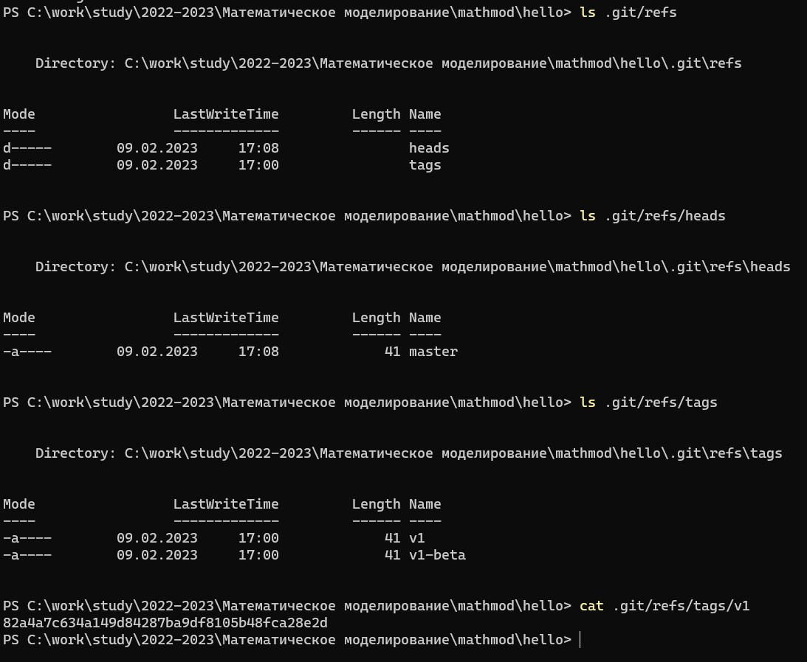

---
## Front matter
lang: ru-RU
title: Презентация по лабораторной работе № 1
subtitle: Математическое моделирование
author: Адебайо Р. А.
institute: Российский университет дружбы народов, Москва, Россия
date: 11 февраля 2023

## i18n babel
babel-lang: russian
babel-otherlangs: english

## Formatting pdf
toc: false
toc-title: Содержание
slide_level: 2
aspectratio: 169
section-titles: true
theme: metropolis
header-includes:
 - \metroset{progressbar=frametitle,sectionpage=progressbar,numbering=fraction}
 - '\makeatletter'
 - '\beamer@ignorenonframefalse'
 - '\makeatother'
---
## Лабораторная работа № 1

**Докладчик: Адебайо Ридвануллахи Айофе**

**Студ. Билет: 1032205020**

**Группа: НКНбд-01-20**

## Цель работы

Целью данной работы является настройка среды для курса математическое моделирование, установка make, pandoc, texlive, julia, openmodelica.

Другая цель - ознакомиться с git и настроить как локальный, так и удаленный репозиторий для курса

## Cоздание шаблонов для лабораторных отчетов

Я создал файлы, необходимые для лабораторной работы, поэтому я могу подготовить шаблон для отчета и презентации, используя `mkdir`.

{#fig:001 width=35%}

## Git

Git Bash — это приложение для сред Microsoft Windows, которое предоставляет эмуляцию bash, используемую для запуска Git из командной строки. Это не простой bash, скомпилированный для Windows, а пакет, содержащий Bash, SSH, SCP и некоторые другие утилиты Unix, скомпилированные для Windows. Он также содержит новое окно терминала интерфейса командной строки под названием minty. Эти утилиты связаны с этим пакетом Bash, чтобы создать полезный пакет программного обеспечения.

## Конфигурация git

{#fig:002 width=70%}

## Работа с git

{#fig:003 width=40%}

## Работа с git

{#fig:04 width=50%}

## Markdown

Markdown — облегчённый язык разметки, созданный с целью обозначения форматирования в простом тексте, с максимальным сохранением его читаемости человеком, и пригодный для машинного преобразования в языки для продвинутых публикаций (HTML, Rich Text и других).

## Результаты

Выполнив все задания для этой лабораторной работы, я смог расширить свои знания о том, как использовать git, а также о том, как использовать chocolatey для установки пакетов. Я также научился использовать powershell, также известный как командная строка или терминал.
