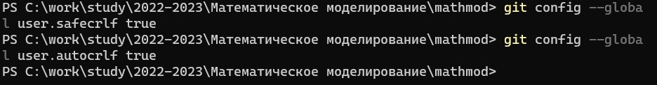
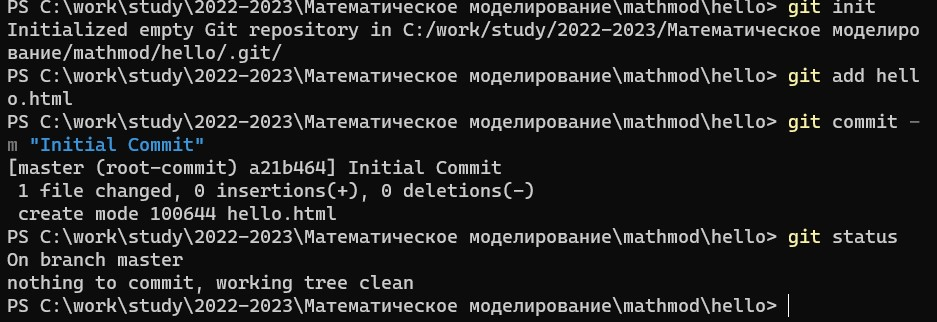
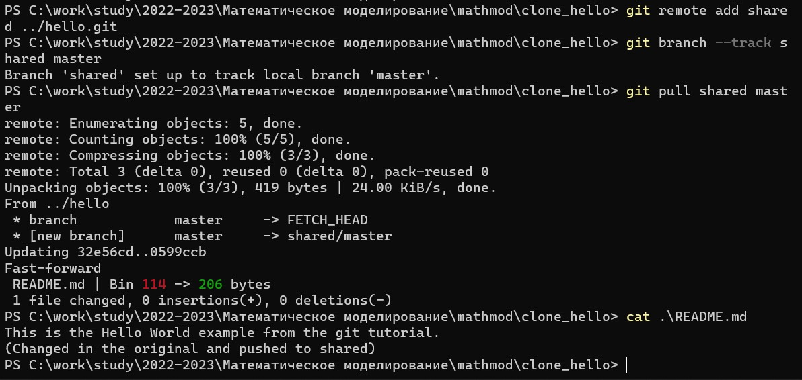

---
## Front matter
title: "Шаблон отчёта по лабораторной работе № 1"
subtitle: "Математическое моделирование"
author: "Адебайо Ридвануллахи Айофе"

## Generic otions
lang: ru-RU
toc-title: "Содержание"

## Bibliography
bibliography: bib/cite.bib
csl: pandoc/csl/gost-r-7-0-5-2008-numeric.csl

## Pdf output format
toc: true # Table of contents
toc-depth: 2
lof: true # List of figures
lot: true # List of tables
fontsize: 12pt
linestretch: 1.5
papersize: a4
documentclass: scrreprt
## I18n polyglossia
polyglossia-lang:
  name: russian
  options:
	- spelling=modern
	- babelshorthands=true
polyglossia-otherlangs:
  name: english
## I18n babel
babel-lang: russian
babel-otherlangs: english
## Fonts
mainfont: PT Serif
romanfont: PT Serif
sansfont: PT Sans
monofont: PT Mono
mainfontoptions: Ligatures=TeX
romanfontoptions: Ligatures=TeX
sansfontoptions: Ligatures=TeX,Scale=MatchLowercase
monofontoptions: Scale=MatchLowercase,Scale=0.9
## Biblatex
biblatex: true
biblio-style: "gost-numeric"
biblatexoptions:
  - parentracker=true
  - backend=biber
  - hyperref=auto
  - language=auto
  - autolang=other*
  - citestyle=gost-numeric
## Pandoc-crossref LaTeX customization
figureTitle: "Рис."
tableTitle: "Таблица"
listingTitle: "Листинг"
lofTitle: "Список иллюстраций"
lotTitle: "Список таблиц"
lolTitle: "Листинги"
## Misc options
indent: true
header-includes:
  - \usepackage{indentfirst}
  - \usepackage{float} # keep figures where there are in the text
  - \floatplacement{figure}{H} # keep figures where there are in the text
---

## Цель работы

Целью данной работы является настройка среды для курса математическое моделирование, установка make, pandoc, texlive, julia, openmodelica.

Другая цель - ознакомиться с git и настроить как локальный, так и удаленный репозиторий для курса

## Задание

• Сделайте отчёт по предыдущей лабораторной работе в формате
Markdown.

• В качестве отчёта просьба предоставить отчёты в 3 форматах:
pdf, docx и md (в архиве, поскольку он должен содержать скриншоты, Makefile и т.д.)

## Теоретическое введение

Git Bash — это приложение для сред Microsoft Windows, которое предоставляет эмуляцию bash, используемую для запуска Git из командной строки. Это не простой bash, скомпилированный для Windows, а пакет, содержащий Bash, SSH, SCP и некоторые другие утилиты Unix, скомпилированные для Windows. Он также содержит новое окно терминала интерфейса командной строки под названием minty. Эти утилиты связаны с этим пакетом Bash, чтобы создать полезный пакет программного обеспечения.

Markdown — облегчённый язык разметки, созданный с целью обозначения форматирования в простом тексте, с максимальным сохранением его читаемости человеком, и пригодный для машинного преобразования в языки для продвинутых публикаций (HTML, Rich Text и других).

## Выполнение лабораторной работы

## 1.1 Подготовка

**1.1.1 Создание файлов для каждой лабораторной работы**

Я создал файлы, необходимые для лабораторной работы, поэтому я могу подготовить шаблон для отчета и презентации, используя `mkdir`.

{#fig:001 width=50%}

**1.1.2 Установка имени и электронной почты**

Я выполнил следующие команды, чтобы узнал моё имя и электронную почту

{#fig:002 width=70%}

**1.1.3 Параметры установки окончаний строк**

Я с помощью команд `git config --global core.autocrlf true` и `git config --global core.safecrlf true` настроил `core.autocrlf`, чтобы все переводы строк текстовых файлов в репозитории были одинаковы.

{#fig:003 width=70%}

{#fig:004 width=70%}

## 1.2 Создание проекта

**1.2.1 Создаем страницу "Hello, World"**

Начал работу в пустом рабочем каталоге с создания пустого каталога с именем hello, затем вошел в него и создайте там файл с именем hello.html.
`mkdir hello`
`cd hello`
`touch hello.html`
`echo "Hello, World!" > hello.html`
и создал `git` репозиторий из этого каталога, выполнил команду `git init`

{#fig:005 width=70%}

**1.2.2 Добавление файла в репозиторий**

Добавил файл в репозиторий с помощью команд `git add hello.html` и `git commit -m "Initial Commit"`.
и проверил статус с помощью `git status`

{#fig:006 width=70%}

## 1.3 Индексация изменений

**1.3.1 Коммит изменений**

Сделал коммит и проверим состояние с помощью `git commit`.
Проверил состояние каталога с помощью `git status`.

{#fig:007 width=70%}

{#fig:008 width=70%}

**1.3.2 Добавьте стандартные теги страницы**

Изменил страницу «Hello, World», чтобы она содержала стандартные теги `<html>` и `<body>`.

{#fig:009 width=70%}

**1.3.3 История**

Получил список произведенных изменений с помощью git log

{#fig:010 width=70%}

**1.3.4 Просмотр тегов с помощью команды tag**

Я увидел, какие теги доступны, используя команду git tag, и посмотрел теги в логе с помощью git log master --all.

{#fig:011 width=70%}

## 1.4 Отмена локальных изменений (до индексации)

**1.4.1 Отмена изменений в рабочем каталоге**

Использовал команду `git checkout` для переключения версии файла
`hello.html` в репозитории.

{#fig:012 width=70%}

## 1.5 Отмена проиндексированных изменений(перед коммитом)

**1.5.1 Переключимся на версию коммита**

Чтобы сделать рабочий каталог чистым, выполним следующие команды

{#fig:013 width=70%}

## 1.6 Отмена коммитов

**1.6.1 Сделайте коммит с новыми изменениями, отменяющими предыдущие**

Чтобы отменить коммит, нам необходимо сделать коммит, который удаляет изменения, сохраненные нежелательным коммитом.

{#fig:014 width=70%}

**1.6.2 Проверьте лог**

Проверка лога показывает нежелательные и отмененные коммиты в наш репозиторий.

{#fig:015 width=70%}

## 1.7 Git внутри: Каталог .git

**1.7.1 База данных объектов**

Выполнил ls -C .git/objects

{#fig:016 width=70%}

**1.7.2 Config File**

Выполнил cat .git/config

{#fig:017 width=70%}

**1.7.3 Ветки и теги**

Выполнил:

ls .git/refs

ls .git/refs/heads

ls .git/refs/tags

cat .git/refs/tags/v1

{#fig:018 width=70%}

## 1.8 Создание ветки

**1.8.1 Изменим index.html**

Обновим файл index.html, чтобы он тоже использовал style.css

{#fig:019 width=70%}

## 1.9 Навигация по веткам

Теперь в нашем проекте есть две ветки. Выполним git log --all.

{#fig:020 width=70%}

**1.9.1 Вернемся к ветке style**

Выполнил:

git checkout style

сat lib/hello.html

{#fig:021 width=70%}

## 1.10 Сделайте коммит изменений README.md в ветку master

Выполнил:

git add README.md

git commit -m "Added README"

{#fig:022 width=70%}

**1.10.1 Просмотр отличающихся веток**

Теперь у нас в репозитории есть две отличающиеся ветки. Выполнил git log --graph --all.

{#fig:023 width=70%}

## 1.11 Создание конфликта

**1.11.1 Слияние master с веткой style**

Теперь вернемся к ветке style и попытаемся объединить ее с новой веткой master.

Выполнила (рис.86):

git checkout style

git merge master

{#fig:024 width=70%}

## 1.12 Клонирование репозиториев

**1.12.1 Перейдите в рабочий каталог**

Выполнил:
cd ..
pwd
ls

{#fig:025 width=70%}

**1.12.2 Создайте клон репозитория hello**

Выполнил:
git clone hello cloned_hello
ls

{#fig:026 width=70%}

## 1.13 Просмотр клонированного репозитория

**1.13.1 Давайте взглянем на клонированный репозиторий**

Выполнил:
cd cloned_hello
ls

{#fig:027 width=70%}

**1.13.2 Просмотрите историю репозитория**

Выполнил:
git log --all

{#fig:028 width=70%}

## 1.14 Что такое origin?

Выполнил:
git remote

{#fig:029 width=70%}

## 1.15 Изменение оригинального репозитория

**1.15.1 Извлечение изменений**

Научиться извлекать изменения из удаленного репозитория.

Выполним (рис.102):

`cd ../cloned_hello`

`git fetch`

`git log --all`

{#fig:030 width=70%}

{#fig:031 width=70%}

## 1.16 Слияние извлеченных изменений

**1.16.1 Еще раз проверьте файл README.md**

Сейчас мы должны увидеть изменения.
Выполним: `cat README.md`

{#fig:032 width=70%}

## 1.17 Добавление ветки наблюдения

**1.17.1 Добавьте локальную ветку, которая отслеживает удаленную ветку**

Выполнил:
git branch --track style origin/style
git branch -a
git log --max-count=2

{#fig:033 width=70%}

## 1.18 Добавление удаленного репозитория

Добавим репозиторий hello.git к нашему оригинальному репозиторию. Выполнил:

`cd hello`

`git remote add shared ../hello.git`

{#fig:034 width=70%}

## 1.19 Отправка изменений

{#fig:035 width=70%}

## 1.20 Извлечение общих изменений

Научимся извлекать изменения из общего репозитория.

Выполним (рис.112):

cd ../cloned_hello

git remote add shared ../hello.git

git branch --track shared master

git pull shared master

cat README.md
{#fig:036 width=70%}

## Выводы

Выполнив все задания для этой лабораторной работы, я смог расширить свои знания о том, как использовать git, а также о том, как использовать chocolatey для установки пакетов. Я также научился использовать powershell, также известный как командная строка или терминал.

## Список литературы{.unnumbered}

Кулябов Д. С.  *Лабораторная работа №1**: git.pdf*

Кулябов Д. С.  *Лабораторная работа №1**: markdown.pdf*
