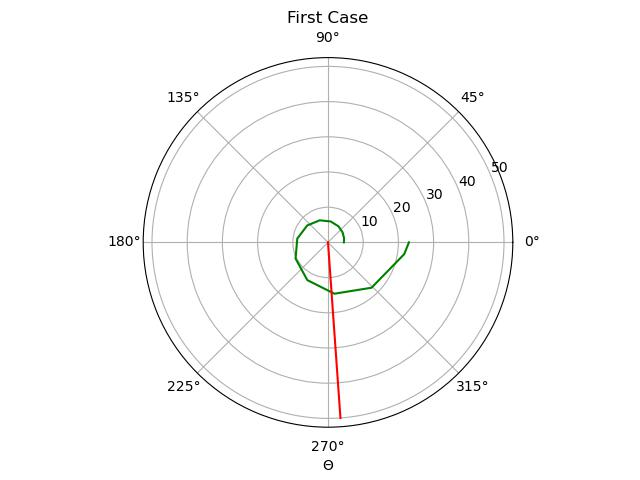
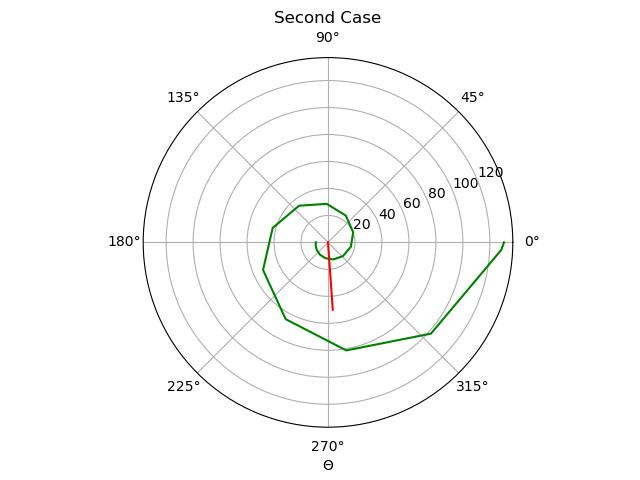

---
## Front matter
title: "Шаблон отчёта по лабораторной работе № 2"
subtitle: "Математическое моделирование"
author: "Адебайо Ридвануллахи Айофе"

## Generic otions
lang: ru-RU
toc-title: "Содержание"

## Bibliography
bibliography: bib/cite.bib
csl: pandoc/csl/gost-r-7-0-5-2008-numeric.csl

## Pdf output format
toc: true # Table of contents
toc-depth: 2
lof: true # List of figures
lot: true # List of tables
fontsize: 12pt
linestretch: 1.5
papersize: a4
documentclass: scrreprt
## I18n polyglossia
polyglossia-lang:
  name: russian
  options:
	- spelling=modern
	- babelshorthands=true
polyglossia-otherlangs:
  name: english
## I18n babel
babel-lang: russian
babel-otherlangs: english
## Fonts
mainfont: PT Serif
romanfont: PT Serif
sansfont: PT Sans
monofont: PT Mono
mainfontoptions: Ligatures=TeX
romanfontoptions: Ligatures=TeX
sansfontoptions: Ligatures=TeX,Scale=MatchLowercase
monofontoptions: Scale=MatchLowercase,Scale=0.9
## Biblatex
biblatex: true
biblio-style: "gost-numeric"
biblatexoptions:
  - parentracker=true
  - backend=biber
  - hyperref=auto
  - language=auto
  - autolang=other*
  - citestyle=gost-numeric
## Pandoc-crossref LaTeX customization
figureTitle: "Рис."
tableTitle: "Таблица"
listingTitle: "Листинг"
lofTitle: "Список иллюстраций"
lotTitle: "Список таблиц"
lolTitle: "Листинги"
## Misc options
indent: true
header-includes:
  - \usepackage{indentfirst}
  - \usepackage{float} # keep figures where there are in the text
  - \floatplacement{figure}{H} # keep figures where there are in the text
---

# Цель работы

Научиться работать с Julia, решать задачу о погоне, строить графики траектории движения.

# Задание

На море в тумане катер береговой охраны преследует лодку браконьеров. Через определенный промежуток времени туман рассеивается, и лодка обнаруживается на расстоянии 9 км от катера. Затем лодка снова скрывается в тумане и уходит прямолинейно в неизвестном направлении. Известно, что скорость катера в 3 раза больше скорости браконьерской лодки.

1. Запишите уравнение, описывающее движение катера, с начальными условиями для двух случаев (в зависимости от расположения катера относительно лодки в начальный момент времени).
2. Постройте траекторию движения катера и лодки для двух случаев.
3. Найдите точку пересечения траектории катера и лодки

# Теоретическое введение

Julia - это высокоуровневый динамический язык программирования. Его функции хорошо подходят для численного анализа и вычислительной науки. Отличительные аспекты дизайна Джулии включают систему типов с параметрическим полиморфизмом на динамическом языке программирования; с множественной отправкой в качестве основной парадигмы программирования.

# Выполнение лабораторной работы

## Постановка задачи 

1. Пусть место нахождения лодки браконьеров в момент обнаружения:  t_0=0,x_{л0}=0 . Пусть место нахождения катера береговой охраны относительно лодки браконьеров в момент обнаружения лодки: x_{к0}=0.
2. Введем полярные координаты. Будем считать, что полюс - это точка обнаружения лодки браконьеров x_{л0} (0=x_{л0}=0) , а полярная ось r проходит через точку нахождения катера  береговой охраны.
3. Траектория катера должна быть такой, чтобы и катер, и лодка все время были на одном расстоянии от полюса, только в этом случае траектория катера пересечется с траекторией лодки. Поэтому для начала катер береговой охраны должен двигаться некоторое время прямолинейно, пока не окажется на том же расстоянии от полюса, что и лодка браконьеров. После этого катер береговой охраны должен двигаться вокруг полюса удаляясь от него с той же скоростью, что и лодка браконьеров.
4. Чтобы найти расстояние X (расстояние, после которого катер начнет двигаться вокруг полюса),
    необходимо составить простое уравнение. Пусть через время t катер и лодка окажутся на одном расстоянии x от полюса. За это время лодка пройдет x, а катер — k-x (или k+x в зависимости
    от начального положения катера относительно полюса). Время, за которое они пройдут это расстояние, вычисляется как x/v или k-x/3v (во втором случае k+x/3v). Так как время одно и то 
    же, то эти величины одинаковы. Тогда неизвестное расстояние x можно найти из следующего уравнения:x/v=(k-x)/3v в первом случае и x/v=(k+x)/3v во втором. Отсюда мы найдем два значения x_1=k/4 и x_2=k/2, задачу будем решать для двух случаев.
5. После того, как катер береговой охраны окажется на одном расстоянии от полюса, что и лодка, он должен сменить прямолинейную траекторию и начать двигаться вокруг полюса, удаляясь от него со скоростью лодки v. Для этого скорость катера раскладываем на две составляющие: v_r — радиальная 
    скорость и v_τ — тангенциальная скорость. Радиальная скорость - это скорость, с которой катер 
    удаляется от полюса, v_r=dr/dt. Нам нужно, чтобы эта скорость была равна скорости лодки, поэтому полагаем dr/dt=v. Тангенциальная скорость – это линейная скорость вращения катера
    относительно полюса. Она равна произведению угловой скорости ∂θ/∂t на радиус r, v_τ=r*∂θ/∂t
    v_τ=√(9v^2-v^2 )=√8*v (учитывая, что радиальная скорость равна v). Тогда получаем r*∂θ∂t=√8*v.
6. Решение исходной задачи сводится к решению системы из двух дифференциальных уравнений. Далее, исключая из полученной системы  производную по t, переходим к одному уравнению: ∂r/∂θ=r/√8. При этом, начальные условия остаются прежними. Решив это уравнение, мы получаем
траекторию движения катера в полярных координатах.

## Код

```Julia
using DifferentialEquations
using PyPlot

const x_1 =  9/2
const tetha1 = 0
#const x_2 = 9/2
const tetha2 = - π
const T = (-π, 2π)

function F(u, p, T)
    return u / sqrt(8) 
end

prob1 = ODEProblem(F, x_1, T)

sol1= solve(prob1, abstol= 1e-8, reltol= 1e-8)

polar(sol1.t, sol1.u + fill(x_1, 20), color = "green")
plot(fill(-1.5,6), collect(0:10:50), color = "red")
xlabel("Θ")
title("Second Case")
savefig("case2.jpg")
```

## Полученные графики

Первый случай (рис.1):



Второй случай (рис.2):



# Выводы

В ходе выполнения лабораторной работы я освоил Scilab, научился решать задачу о погоне и строить графики, записал уравнение, описывающее движение катера, с начальными условиями для двух случаев (в зависимости от расположения катера относительно лодки в начальный момент времени),  построил траекторию движения катера и лодки для двух случаев, нашел точку пересечения траектории катера и лодки.
<!-- 
# Список литературы{.unnumbered}

::: {#refs}
::: -->
