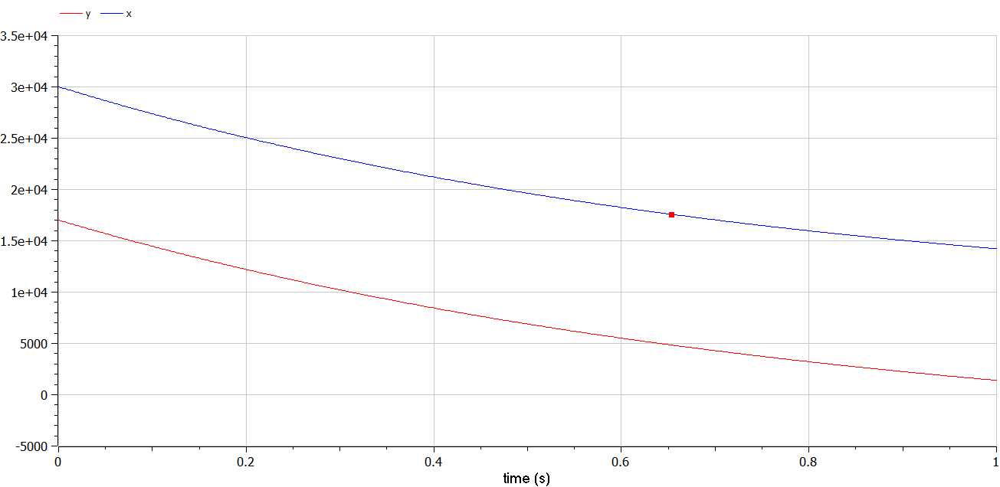

---
## Front matter
lang: ru-RU
title: Презентация по лабораторной работе № 3
subtitle: Математическое моделирование
author: Адебайо Р. А.
institute: Российский университет дружбы народов, Москва, Россия
date: 24 февраля 2023

## i18n babel
babel-lang: russian
babel-otherlangs: english

## Formatting pdf
toc: false
toc-title: Содержание
slide_level: 2
aspectratio: 169
section-titles: true
theme: metropolis
header-includes:
 - \metroset{progressbar=frametitle,sectionpage=progressbar,numbering=fraction}
 - '\makeatletter'
 - '\beamer@ignorenonframefalse'
 - '\makeatother'
---

# Информация

## Докладчик

:::::::::::::: {.columns align=center}
::: {.column width="70%"}

  * Адебайо Ридвануллахи Айофе
  * студент группы НКНбд-01-20
  * Факультет физико-математических и естественных наук
  * Российский университет дружбы народов
  * [Страничка на GitHub](https://github.com/PrinceKay145)

:::
::::::::::::::

# Вводная часть
## Прагматика выполнения

- Рассмотрение простейшей модели боевых действий – модели Ланчестера

- Использование Julia для выполнения лабораторных работ

- Использование OpenModelica для выполнения лабораторных работ

- Применение полученных знаний на практике в дальнейшем

## Цель работы

- Научиться работать с Julia

- Научиться работать с OpenModelica

- Научиться составлять системы дифференциальных уравнений изменения численностей армий

- Научиться строить графики для модели Ланчестера

- Cравнить результат от Julia и Openmodelica

- Получение новых знаний в ходе выполнения лабораторной работы

## Openmodelica

- Modelica — объектно-ориентированный, декларативный, мультидоменный язык моделирования для компонентно-ориентированного моделирования сложных систем, в частности, систем, содержащих механические, электрические, электронные, гидравлические, тепловые, энергетические компоненты, а также компоненты управления и компоненты, ориентированные на отдельные процессы

- Modelica разработана некоммерческой организацией Modelica Association

- Modelica является языком моделирования, а не обычным языком программирования

- Классы Modelica не компилируются в обычном смысле, но преобразуются в объекты, которые затем используются специализированным процессором

## Openmodelica

- В терминах языка Modelica точки, уравнения не задают заранее определенную причинно-следственную связь

- Cпециализированный процессор может манипулировать уравнениями в символьном виде, определяя порядок их исполнения и то, какие компоненты в этом уравнении определяют входы и выходы

- OpenModelica — среда для моделирования, опирающаяся на открытый код и язык Modelica, ориентированная для промышленного и академического применения

# Модель боевых действий Ланчестера

- Моделирование боевых и военных действий является важнейшей научной и практической задачей, направленной на предоставление командованию количественных оснований для принятия решений

- В противоборстве могут принимать участие как регулярные войска, так и партизанские отряды. В общем случае главной характеристикой соперников являются численности сторон. Если в какой-то момент времени одна из численностей обращается в нуль, то данная сторона считается проигравшей (при условии, что численность другой стороны в данный момент положительна)

- Простейшие модели соперничества соответствуют системам обыкновенных дифференциальных уравнений второго порядка, широко распространенным при описании многих естественно научных объектов

# Полученные графики

## Полученные графики(OpenModelica)

## Полученные графики(Julia)

# Результаты

- Узнал много нового, работая с языком программирования Julia

- Я познакомился с Openmodelica

- Научились составлять системы дифференциальных уравнений изменения численностей армий

- Научились строить графики для модели Ланчестера