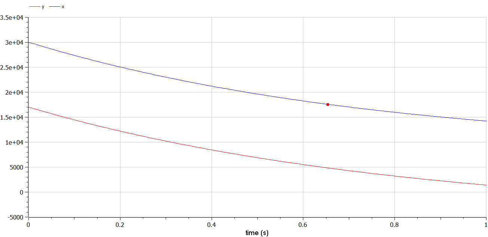
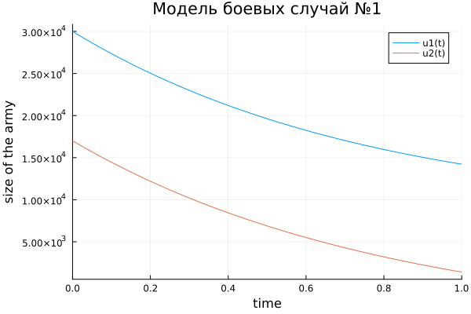
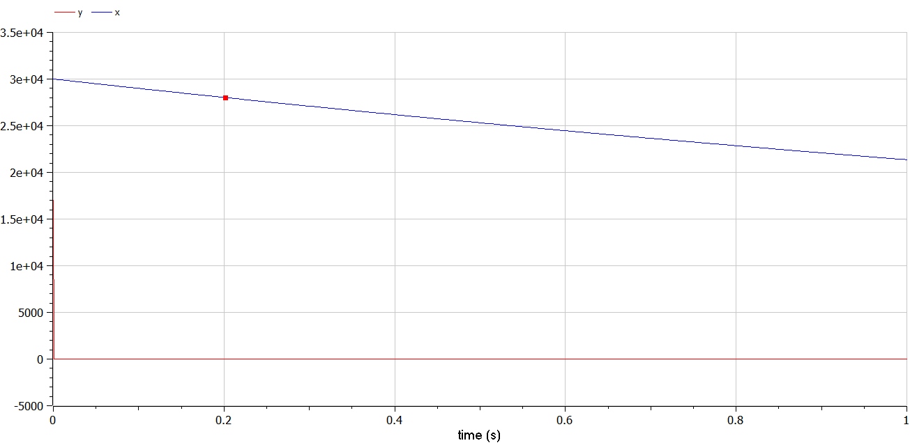
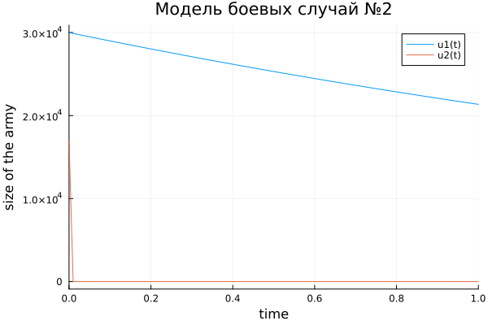

---
## Front matter
title: "Отчёта по лабораторной работе № 3"
subtitle: "Математическое моделирование"
author: "Адебайо Ридвануллахи Айофе"

## Generic otions
lang: ru-RU
toc-title: "Содержание"

## Bibliography
bibliography: bib/cite.bib
csl: pandoc/csl/gost-r-7-0-5-2008-numeric.csl

## Pdf output format
toc: true # Table of contents
toc-depth: 2
lof: true # List of figures
lot: true # List of tables
fontsize: 12pt
linestretch: 1.5
papersize: a4
documentclass: scrreprt
## I18n polyglossia
polyglossia-lang:
  name: russian
  options:
	- spelling=modern
	- babelshorthands=true
polyglossia-otherlangs:
  name: english
## I18n babel
babel-lang: russian
babel-otherlangs: english
## Fonts
mainfont: PT Serif
romanfont: PT Serif
sansfont: PT Sans
monofont: PT Mono
mainfontoptions: Ligatures=TeX
romanfontoptions: Ligatures=TeX
sansfontoptions: Ligatures=TeX,Scale=MatchLowercase
monofontoptions: Scale=MatchLowercase,Scale=0.9
## Biblatex
biblatex: true
biblio-style: "gost-numeric"
biblatexoptions:
  - parentracker=true
  - backend=biber
  - hyperref=auto
  - language=auto
  - autolang=other*
  - citestyle=gost-numeric
## Pandoc-crossref LaTeX customization
figureTitle: "Рис."
tableTitle: "Таблица"
listingTitle: "Листинг"
lofTitle: "Список иллюстраций"
lotTitle: "Список таблиц"
lolTitle: "Листинги"
## Misc options
indent: true
header-includes:
  - \usepackage{indentfirst}
  - \usepackage{float} # keep figures where there are in the text
  - \floatplacement{figure}{H} # keep figures where there are in the text
---

# Цель работы

Научиться работать в OpenModelica. Рассмотреть простейшую модель боевых действий – модель Ланчестера. Научиться строить графики для данной модели.

# Задание

Между страной Х и страной У идет война. Численность состава войск исчисляется от начала войны, и являются временными функциями x(t) и y(t). В начальный момент времени страна Х имеет армию численностью 30 000 человек, а в распоряжении страны У армия численностью в 17 000 человек. Для упрощения модели считаем, что коэффициенты a,\ b,\ c,\ h постоянны. Также считаем P(t) и Q(t) непрерывные функции.

Постройте графики изменения численности войск армии Х и армии У для следующих случаев:

1. Модель боевых действий между регулярными войсками

$$
  \frac{dx}{dt} = -0,45x(t)-0,86y(t)+sin(t+1)
$$

$$
\frac{dy}{dt} = -0,49x(t)-0,73y(t)+cos(t+2)
$$

2. Модель ведение боевых действий с участием регулярных войск и партизанских отрядов

$$
  \frac{dx}{dt} = -0,34x(t)-0,81y(t)+sin(2t)
$$

$$
  \frac{dy}{dt} = -0,22x(t)y(t)-0,91y(t)+cos(t)
$$

# Теоретическое введение

OpenModelica - это свободная среда для моделирования и симуляции динамических систем, таких как системы управления, электромеханические системы, системы жизнеобеспечения и другие. С помощью OpenModelica можно создавать и анализировать модели систем в различных областях, таких как промышленность, энергетика, автоматизация, медицина и наука. Среда поддерживает язык моделирования Modelica и имеет открытый исходный код

Модель Ланчестера. В противоборстве могут принимать участие как регулярные войска, так и партизанские отряды. В общем случае главной характеристикой соперников являются численности сторон. Если в какой-то момент времени одна из численностей обращается в нуль, то данная сторона считается проигравшей (при условии, что численность другой стороны в данный момент положительна).

В этой работе рассмотрим два случая ведения боевых действий:

1. Боевые действия между регулярными войсками.

2. Боевые действия с участием регулярных войск и партизанских отрядов.

# Выполнение лабораторной работы

## Коды

### Код на OpenModelica

```M
model MLab31
//Модель боевых действий между регулярными войсками
parameter Real a=0.45;
parameter Real b=0.86;
parameter Real c=0.49;
parameter Real h=0.73;
Real p;
Real q;
Real x;
Real y;
Real t=0;
initial equation
   x=30000;
   y=17000;
  
equation
  p=sin(t+1);
  q=cos(t+2);
  der(x) = -a*x -b*y +p ;
  der(y) = -c*x -h*y + q; 
end MLab31;
```

```M
model MLab32
//Модель ведение боевых действий с участием регулярных войск и партизанских отрядов
parameter Real a=0.34;
parameter Real b=0.81;
parameter Real c=0.22;
parameter Real h=0.91;
Real p;
Real q;
Real x;
Real y;
Real t=0;
initial equation
   x=30000;
   y=17000;
  
equation
  p=sin(t+1);
  q=cos(t+2);
  der(x) = -a*x -b*y +p ;
  der(y) = -c*x*y -h*y + q; 
end MLab32;
```

### Код на Julia

```Julia
using DifferentialEquations
using Plots

x0=30000
y0=17000
a=0.45
b=0.86
c=0.49
h=0.73
a2=0.34
b2=0.81
c2=0.22
h2=0.91
t0=0.0
tmax=1.0
function P(t)
    return sin(t+1)
end

function Q(t)
    return cos(t+2)
end

function P2(t)
    return sin(2*t)
end

function Q2(t)
    return cos(t)
end

function F(du, u, p, t)
    du[1]= -a*u[1]-b*u[2]+P(t)
    du[2]= -c*u[1]-h*u[2]+Q(t)
end

function F2(du, u, p, t)
    du[1]= -a2*u[1]-b2*u[2]+P(t)
    du[2]= -c2*u[1]*u[2]-h2*u[2]+Q(t)
end
tspan=(t0,tmax)
t=collect(LinRange(0,1,100))
u0 = [x0;y0]
prob1 = ODEProblem(F,u0, tspan)
sol1=solve(prob1, saveat=t)

prob2=ODEProblem(F2,u0, tspan)
sol2=solve(prob2, saveat=t)

plot(sol1)
savefig("Jlab31.png")
plot(sol2)
savefig("Jlab32.png")
```

## Полученные графики

Модель боевых действий между регулярными войсками :





Модель ведение боевых действий с участием регулярных войск и партизанских отрядов :





# Выводы

Во время лабораторной работы я научился работать с Openmodelica, а также рассмотрел и построил простейшую модель боевых действий – модель Ланчестера


# Список литературы

::: {#refs}
:::

1. Кулябов Д. С.  *Лабораторная работа №3* : https://esystem.rudn.ru/mod/resource/view.php?id=831037

2. ModelicaByExamples : https://github.com/mtiller/ModelicaBook

3. Julia : https://julialang.org/
