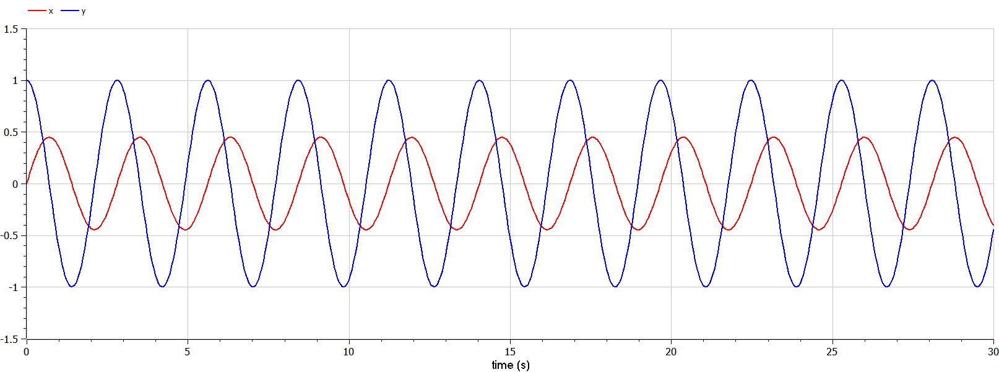
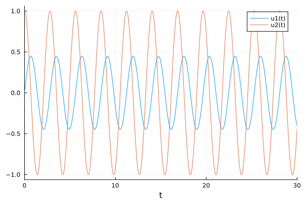
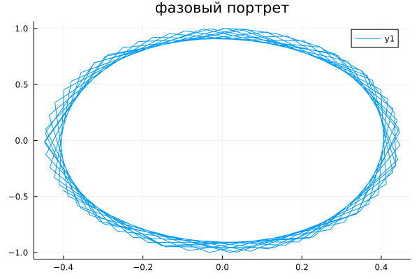
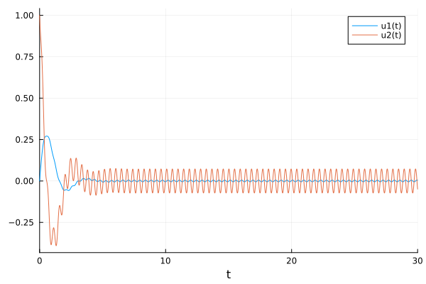
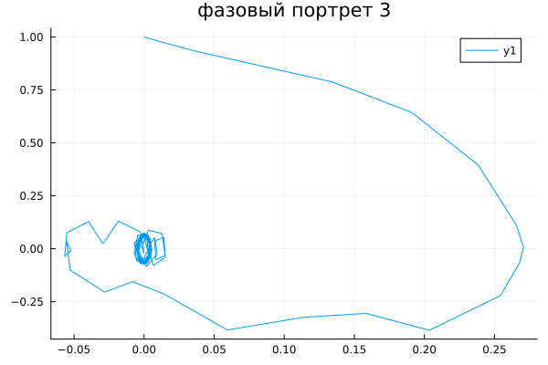

---
## Front matter
lang: ru-RU
title: Презентация по лабораторной работе № 4
subtitle: Математическое моделирование
author: Адебайо Р. А.
institute: Российский университет дружбы народов, Москва, Россия
date: 04 марта 2023

## i18n babel
babel-lang: russian
babel-otherlangs: english

## Formatting pdf
toc: false
toc-title: Содержание
slide_level: 2
aspectratio: 169
section-titles: true
theme: metropolis
header-includes:
 - \metroset{progressbar=frametitle,sectionpage=progressbar,numbering=fraction}
 - '\makeatletter'
 - '\beamer@ignorenonframefalse'
 - '\makeatother'
---

# Информация

## Докладчик

:::::::::::::: {.columns align=center}
::: {.column width="70%"}

  * Адебайо Ридвануллахи Айофе
  * студент группы НКНбд-01-20
  * Факультет физико-математических и естественных наук
  * Российский университет дружбы народов
  * [Страничка на GitHub](https://github.com/PrinceKay145)

:::
::::::::::::::

# Вводная часть

## Прагматика выполнения

- Познакомиться с моделями гармонических колебаний с затуханием и без затухания, под действием внешних сил и без действия внешних сил

- Использование Julia для выполнения лабораторных работ

- Научиться строить фазовые портреты с помощью OpenModelica

- Применение полученных знаний на практике в дальнейшем

## Цель работы

- Научиться работать с Julia

- Научиться работать с OpenModelica

- Построить фазовый портрет гармонического осциллятора

- Решить уравнения гармонического осциллятора

- Cравнить результат от Julia и Openmodelica

- Получение новых знаний в ходе выполнения лабораторной работы

# Определение гармонических колебаний 

Гармонические колебания — колебания, при которых физическая величина изменяется с течением времени по гармоническому (синусоидальному, косинусоидальному) закону.

# Полученные графики

## Полученные графики(OpenModelica)

Колебания гармонического осциллятора без затуханий и без действий внешней силы $\dot x + 5x = 0$

## Полученные графики(OpenModelica)

Колебания гармонического осциллятора без затуханий и без действий внешней силы $\dot x + 5x = 0$

## Полученные графики(OpenModelica)

Колебания гармонического осциллятора c затуханием и под действием внешней силы $\ddot x + 4 \dot x + x = \sin(14t)$

## Полученные графики(OpenModelica)

Колебания гармонического осциллятора c затуханием и под действием внешней силы $\ddot x + 4 \dot x + x = \sin(14t)$

## Полученные графики(Julia)

Колебания гармонического осциллятора без затуханий и без действий внешней силы $\dot x + 5x = 0$

## Полученные графики(Julia)

Колебания гармонического осциллятора без затуханий и без действий внешней силы $\dot x + 5x = 0$

## Полученные графики(Julia)

Колебания гармонического осциллятора c затуханием и под действием внешней силы $\ddot x + 4 \dot x + x = \sin(14t)$

## Полученные графики(Julia)

Колебания гармонического осциллятора c затуханием и под действием внешней силы $\ddot x + 4 \dot x + x = \sin(14t)$

# Результаты

- Мы научились работать в Julia

- Мы научились работать в OpenModelica

- Научились решать уравнения гармонического осциллятора

- Научились строить фазовые портреты
