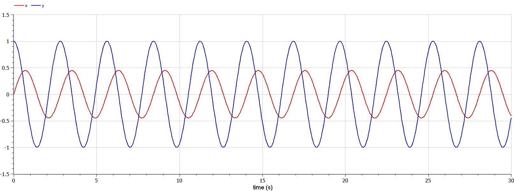
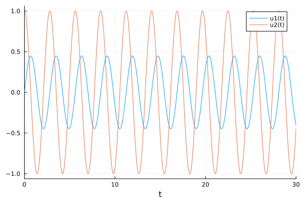
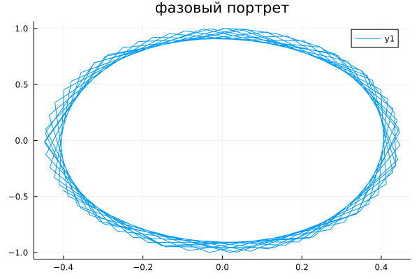
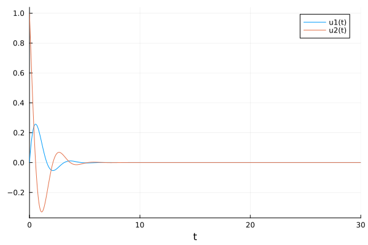
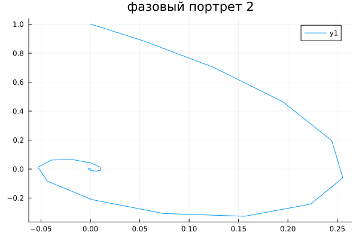
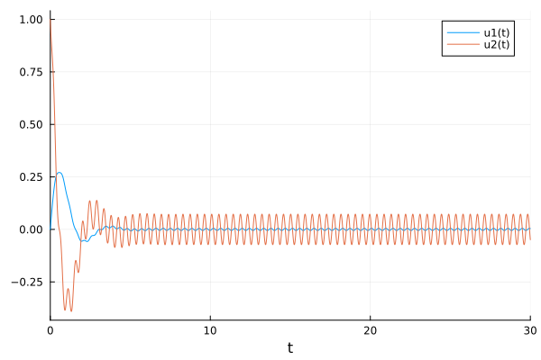
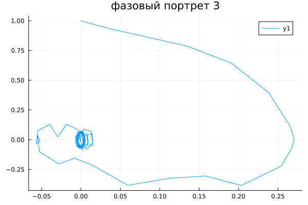

---
## Front matter
title: "Отчёта по лабораторной работе № 4"
subtitle: "Математическое моделирование"
author: "Адебайо Ридвануллахи Айофе"

## Generic otions
lang: ru-RU
toc-title: "Содержание"

## Bibliography
bibliography: bib/cite.bib
csl: pandoc/csl/gost-r-7-0-5-2008-numeric.csl

## Pdf output format
toc: true # Table of contents
toc-depth: 2
lof: true # List of figures
lot: true # List of tables
fontsize: 12pt
linestretch: 1.5
papersize: a4
documentclass: scrreprt
## I18n polyglossia
polyglossia-lang:
  name: russian
  options:
	- spelling=modern
	- babelshorthands=true
polyglossia-otherlangs:
  name: english
## I18n babel
babel-lang: russian
babel-otherlangs: english
## Fonts
mainfont: PT Serif
romanfont: PT Serif
sansfont: PT Sans
monofont: PT Mono
mainfontoptions: Ligatures=TeX
romanfontoptions: Ligatures=TeX
sansfontoptions: Ligatures=TeX,Scale=MatchLowercase
monofontoptions: Scale=MatchLowercase,Scale=0.9
## Biblatex
biblatex: true
biblio-style: "gost-numeric"
biblatexoptions:
  - parentracker=true
  - backend=biber
  - hyperref=auto
  - language=auto
  - autolang=other*
  - citestyle=gost-numeric
## Pandoc-crossref LaTeX customization
figureTitle: "Рис."
tableTitle: "Таблица"
listingTitle: "Листинг"
lofTitle: "Список иллюстраций"
lotTitle: "Список таблиц"
lolTitle: "Листинги"
## Misc options
indent: true
header-includes:
  - \usepackage{indentfirst}
  - \usepackage{float} # keep figures where there are in the text
  - \floatplacement{figure}{H} # keep figures where there are in the text
---

# Цель работы

Построить фазовый портрет гармонического осциллятора и решить уравнения гармонического осциллятора.

# Задание (Вариант 1)

Постройте фазовый портрет гармонического осциллятора и решение уравнения
гармонического осциллятора для следующих случаев

1. Колебания гармонического осциллятора без затуханий и без действий внешней
силы $\dot x + 5x = 0$

2. Колебания гармонического осциллятора c затуханием и без действий внешней силы $\ddot x + 2 \dot x + 5x=0$

3. Колебания гармонического осциллятора c затуханием и под действием внешней
силы $\ddot x + 4 \dot x + x = \sin(14t)$

На интервале $t \in [0; 30] $ (шаг 0.05) с начальными условиями $x_0 =0, y_0 = 1$

# Теоретическое введение

Гармонические колебания — колебания, при которых физическая величина изменяется с течением времени по гармоническому (синусоидальному, косинусоидальному) закону.

Гармонические колебания выделяются из всех остальных видов колебаний по следующим причинам:

- Очень часто малые колебания, как свободные, так и вынужденные, которые происходят в реальных системах, можно считать имеющими форму гармонических колебаний или очень близкую к ней.
- Как установил в 1822 году Фурье, широкий класс периодических функций может быть разложен на сумму тригонометрических компонентов — в ряд Фурье. Другими словами, любое периодическое колебание может быть представлено как сумма гармонических колебаний с соответствующими амплитудами, частотами и начальными фазами. Среди слагаемых этой суммы существует гармоническое колебание с наименьшей частотой, которая называется основной частотой, а само это колебание — первой гармоникой или основным тоном, частоты же всех остальных слагаемых, гармонических колебаний, кратны основной частоте, и эти колебания называются высшими гармониками или обертонами — первым, вторым и т.д.
- Для широкого класса систем откликом на гармоническое воздействие является гармоническое колебание (свойство линейности), при этом связь воздействия и отклика является устойчивой характеристикой системы. С учётом предыдущего свойства это позволяет исследовать прохождение колебаний произвольной формы через системы.

# Выполнение лабораторной работы

## Коды

### Код на OpenModelica

1. Колебания гармонического осциллятора без затуханий и без действий внешней силы

```M
model MLab41
parameter Real w = sqrt(5);
Real x(start =0);
Real y(start =1);

equation
der(x) = y;
der(y) = -w*w*x;
end MLab41;
```

2. Колебания гармонического осциллятора c затуханием и без действий внешней силы

```M
model MLab42
parameter Real w = sqrt(5);
parameter Real g = (2/2);
Real x(start =0);
Real y(start =1);

equation
der(x) = y;
der(y) = -2*g*der(x)-w*w*x;
end MLab42;
```

3. Колебания гармонического осциллятора c затуханием и под действием внешней силы

```M
model MLab43
parameter Real w = sqrt(1);
parameter Real g = (4/2);
Real x(start =0);
Real y(start =1);

equation
der(x) = y;
der(y) = -2*g*der(x)-w*w*x + sin(14*time);
end MLab43;
```

### Код на Julia

1. Колебания гармонического осциллятора без затуханий и без действий внешней силы

```Julia
using DifferentialEquations
using Plots
w=sqrt(5)
x0=0
y0=1
t0=0
tmax=30

function F(du, u, p, t)
    du[1] = u[2]
    du[2] = -w*w*u[1]
end
u0=[x0;y0]
tspan=(t0,tmax)
prob = ODEProblem(F, u0, tspan)
sol=solve(prob)


#plot(sol)

#Рисуем фазовый портрет
plot(
    sol[1, :],
    sol[2, :], 
    title = "фазовый портрет",
    legend=:topright
)
savefig("Jlab411.png")
```

2. Колебания гармонического осциллятора c затуханием и без действий внешней силы

```Julia
using DifferentialEquations
using Plots
w=sqrt(5)
g = (2/2)
x0=0
y0=1
t0=0
tmax=30

function F(du, u, p, t)
    du[1] = u[2]
    du[2] = -2*g*du[1] -w*w*u[1]
end
u0=[x0;y0]
tspan=(t0,tmax)
prob = ODEProblem(F, u0, tspan)
sol=solve(prob)

#plot(sol)
#Рисуем фазовый портрет
plot(
    sol[1, :],
    sol[2, :], 
    title = "фазовый портрет 2",
    legend=:topright
)
savefig("Jlab422.png")
```

3. Колебания гармонического осциллятора c затуханием и под действием внешней силы

```Julia
using DifferentialEquations
using Plots
w=sqrt(5)
g = (2/2)
x0=0
y0=1
t0=0
tmax=30

function F(du, u, p, t)
    du[1] = u[2]
    du[2] = -2*g*du[1] -w*w*u[1] + sin(14*t)
end
u0=[x0;y0]
tspan=(t0,tmax)
prob = ODEProblem(F, u0, tspan)
sol=solve(prob)

#plot(sol)

#Рисуем фазовый портрет
plot(
    sol[1, :],
    sol[2, :], 
    title = "фазовый портрет 3",
    legend=:topright
)
savefig("Jlab433.png")
```

## Полученные графики

1. Колебания гармонического осциллятора без затуханий и без действий внешней силы








2. Колебания гармонического осциллятора c затуханием и без действий внешней силы






3. Колебания гармонического осциллятора c затуханием и под действием внешней силы






# Выводы

В ходе выполнения лабораторной работы я научился строить фазовый портрет гармонического осциллятора и решил уравнения гармонического осциллятора.

# Вопросы к лабораторной работе

1. Простейшим видом колебаний являются гармонические колебания, которые описываются уравнением $x=x_m \cos(\omega t+ \varphi_0)$

2. Осциллятор (лат. oscillo — качаюсь) — система, совершающая колебания, то есть показатели которой периодически повторяются во времени.

3. Модель математического маятника
$$
  \left\{
    \begin{aligned}
    &\frac{d^2\alpha}{d t^2}+\frac{g}{l}\alpha=0, или\\
    &\frac{d^2\alpha}{dt^2}+\omega^2\alpha=0
    \end{aligned} 
  \right.
$$

4. Дифференциальное уравнение второго порядка: $$ \ddot{x}+w_0^2x=f(t) $$ Замена: $$ y=\dot{x} $$ Полученная система уравнений: $$  $$
$$
  \left\{
    \begin{aligned}
    &y =\dot{x};\\
    &\dot{y}=-w_0^2x
    \end{aligned} 
  \right.
$$

5. **Фазовый портрет** -это геометрическое представление траекторий динамической системы в фазовой плоскости. Каждый набор начальных условий представлен другой кривой, или точкой.

6. **Фазовая траектория** -кривая в фазовом пространстве, составленная из точек, представляющих состояние динамической системы в последоват. моменты времени в течение всего времени эволюции.


# Список литературы

1. Кулябов Д. С.  *Лабораторная работа №4* : https://esystem.rudn.ru/course/view.php?id=5930

2. https://studfile.net/preview/2732826/page:6/

3. https://scask.ru/r_book_fluc.php?id=6