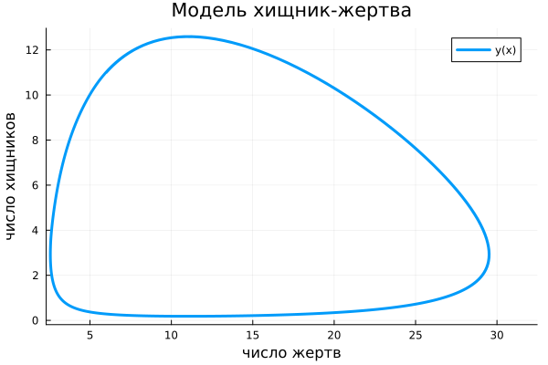
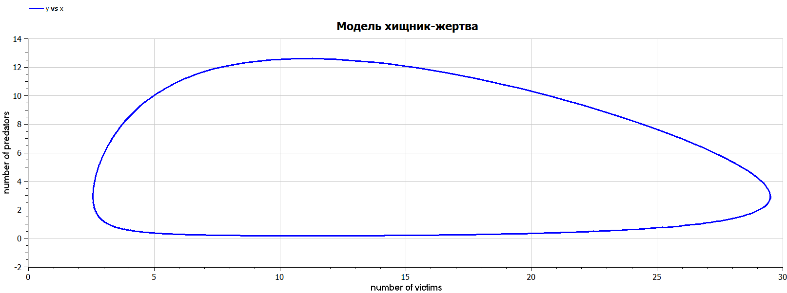

---
## Front matter
lang: ru-RU
title: Презентация по лабораторной работе № 5
subtitle: Математическое моделирование
author: Адебайо Р. А.
institute: Российский университет дружбы народов, Москва, Россия
date: 11 марта 2023
## i18n babel
babel-lang: russian
babel-otherlangs: english

## Formatting pdf
toc: false
toc-title: Содержание
slide_level: 2
aspectratio: 169
section-titles: true
theme: metropolis
header-includes:
 - \metroset{progressbar=frametitle,sectionpage=progressbar,numbering=fraction}
 - '\makeatletter'
 - '\beamer@ignorenonframefalse'
 - '\makeatother'
---

# Информация

## Докладчик

:::::::::::::: {.columns align=center}
::: {.column width="70%"}

* Адебайо Ридвануллахи Айофе
* студент группы НКНбд-01-20
* Факультет физико-математических и естественных наук
* Российский университет дружбы народов
* [Страничка на GitHub](https://github.com/PrinceKay145)
* [Страничка на LinkedIn](https://www.linkedin.com/in/ridwan-adebayo-0443a2231/)

:::
::::::::::::::

# Вводная часть

## Прагматика выполнения

* Познакомиться с моделью хищник-жертва

* Использование Julia для выполнения лабораторных работ

* Научиться строить фазовые портреты с помощью OpenModelica

* Применение полученных знаний на практике в дальнейшем

## Цель работы

* Построить график зависимости численности хищников от численности жертв

* Построить графики изменения численности хищников и численности жертв при заданных начальных условиях

* Найти стационарное состояние системы

* Отработать навыки решения систем дифференциальных уравнений на языке Julia, Openmodelica

# Ход работы

## Задание

Для модели «хищник-жертва»:
$$
  \left\{
  \begin{aligned}
  &\frac{\mathrm{d}x}{\mathrm{d}t} = -0.12 x(t) + 0.041x(t)y(t),\\
  &\frac{\mathrm{d}y}{\mathrm{d}t} = 0.32y(t) - 0.029x(t)y(t).
  \end{aligned}
  \right.
$$

* Постройте график зависимости численности хищников от численности жертв, а также графики изменения численности хищников и численности жертв при следующих начальных условиях: $x_0 = 6, y_0 = 11.$

* Найдите стационарное состояние системы.

## Решение на Julia

```Julia
using DifferentialEquations
using Plots
x0=6
y0=11
u0=[x0,y0]
t0=0
tmax=50
tspan =(t0,tmax)
t= collect(LinRange(t0,tmax,500))
function F(du, u, p, t)
    du[1]=-0.12*u[1]+0.041*u[1]*u[2]
    du[2]=0.32*u[2]-0.029*u[1]*u[2]
end
prob = ODEProblem(F, u0, tspan)
sol = solve(prob, saveat=t)
plt3 = plot(sol, idxs=(1,2),
    title="Модель хищник-жертва",
    xaxis="число жертв",
    yaxis="число хищников",
    label="y(x)", 
    linewidth=3
    )
savefig(plt3, "lab53.png")
```

## Решение на OpenModelica

```M
model Mlab5

Real x(start =6);
Real y(start =11);

equation
der(x) = -0.12*x+0.041*x*y;
der(y) = 0.32*y-0.029*x*y;
end Mlab5;
```

## Результаты

:::::::::::::: {.columns align=center}
::: {.column width="50%"}
{#fig:003 width=60%}
:::
::: {.column width="50%"}
{#fig:004 width=90%}
:::
::::::::::::::

# Вывод

* Мы научились работать на Julia и на OpenModelica

* Построили Модель хищник-жертва

* Научились строить фазовые портреты.

* Заметили, что при реализации на Julia и Openmodelica портреты совпадают

* Нашел стационарное состояние системы
