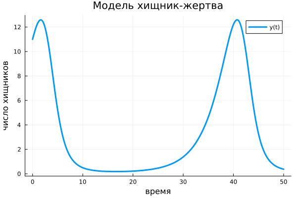

---
## Front matter
title: "Отчёта по лабораторной работе № 5"
subtitle: "Математическое моделирование"
author: "Адебайо Ридвануллахи Айофе"

## Generic otions
lang: ru-RU
toc-title: "Содержание"

## Bibliography
bibliography: bib/cite.bib
csl: pandoc/csl/gost-r-7-0-5-2008-numeric.csl

## Pdf output format
toc: true # Table of contents
toc-depth: 2
lof: true # List of figures
lot: true # List of tables
fontsize: 12pt
linestretch: 1.5
papersize: a4
documentclass: scrreprt
## I18n polyglossia
polyglossia-lang:
  name: russian
  options:
	- spelling=modern
	- babelshorthands=true
polyglossia-otherlangs:
  name: english
## I18n babel
babel-lang: russian
babel-otherlangs: english
## Fonts
mainfont: PT Serif
romanfont: PT Serif
sansfont: PT Sans
monofont: PT Mono
mainfontoptions: Ligatures=TeX
romanfontoptions: Ligatures=TeX
sansfontoptions: Ligatures=TeX,Scale=MatchLowercase
monofontoptions: Scale=MatchLowercase,Scale=0.9
## Biblatex
biblatex: true
biblio-style: "gost-numeric"
biblatexoptions:
  - parentracker=true
  - backend=biber
  - hyperref=auto
  - language=auto
  - autolang=other*
  - citestyle=gost-numeric
## Pandoc-crossref LaTeX customization
figureTitle: "Рис."
tableTitle: "Таблица"
listingTitle: "Листинг"
lofTitle: "Список иллюстраций"
lotTitle: "Список таблиц"
lolTitle: "Листинги"
## Misc options
indent: true
header-includes:
  - \usepackage{indentfirst}
  - \usepackage{float} # keep figures where there are in the text
  - \floatplacement{figure}{H} # keep figures where there are in the text
---
# Цель работы

- Построить Модель хищник-жертва.

- Построить фазовый портрет для модели.

- Отработать навыки решения систем дифференциальных уравнений на языке Julia, Openmodelica

# Задание 

Для модели «хищник-жертва»:
$$
  \left\{
  \begin{aligned}
  &\frac{\mathrm{d}x}{\mathrm{d}t} = -0.12 x(t) + 0.041x(t)y(t),\\
  &\frac{\mathrm{d}y}{\mathrm{d}t} = 0.32y(t) - 0.029x(t)y(t).
  \end{aligned}
  \right.
$$

- Постройте график зависимости численности хищников от численности жертв, а также графики изменения численности хищников и численности жертв при следующих начальных условиях: $x_0 = 6, y_0 = 11.$

- Найдите стационарное состояние системы.


# Теоретическое введение

Простейшая модель взаимодействия двух видов типа «хищник — жертва» - **модель Лотки-Вольтерры**. Данная двувидовая модель основывается на следующих предположениях:

1. Численность популяции жертв x и хищников y зависят только от времени (модель не учитывает пространственное распределение популяции на занимаемой территории)

2. В отсутствии взаимодействия численность видов изменяется по модели Мальтуса, при этом число жертв увеличивается, а число хищников падает

3. Естественная смертность жертвы и естественная рождаемость хищника считаются несущественными

4. Эффект насыщения численности обеих популяций не учитывается

5. Скорость роста численности жертв уменьшается пропорционально численности хищников

$$
  \left\{
  \begin{aligned}
  &\frac{\mathrm{d}x}{\mathrm{d}t} = ax(t) - bx(t)y(t),\\
  &\frac{\mathrm{d}y}{\mathrm{d}t} = -cy(t) + dx(t)y(t).
  \end{aligned}
  \right.
$$

В этой модели $x$ – число жертв, $y$ - число хищников. Коэффициент $a$ описывает скорость естественного прироста числа жертв в отсутствие хищников, $с$ - естественное вымирание хищников, лишенных пищи в виде жертв. Вероятность взаимодействия жертвы и хищника считается пропорциональной как количеству жертв, так и числу самих хищников ($xy$).  Каждый акт взаимодействия уменьшает популяцию жертв, но способствует увеличению популяции хищников (члены - $bxy$ и $dxy$ в правой части уравнения)

Стационарное состояние системы (1) (положение равновесия, не зависящее от времени решение) будет в точке: $x_0 = \frac{c}{d}, y_0 = \frac{a}{b}$. Если начальные значения
задать в стационарном состоянии $x(0) = x_0, y(0) = y_0$, то в любой момент времени
численность популяций изменяться не будет.

# Выполнение лабораторной работы

1. Постройте график зависимости численности хищников от численности жертв, а также графики изменения численности хищников и численности жертв при следующих начальных условиях: $x_0 = 6, y_0 = 11.$

Code on OpenModelica

```M
model Mlab5

Real x(start =6);
Real y(start =11);

equation
der(x) = -0.12*x+0.041*x*y;
der(y) = 0.32*y-0.029*x*y;
end Mlab5;
```

{ #fig:001 width=70% height=70% }

{ #fig:002 width=70% height=70% }

{ #fig:003 width=70% height=70% }

Code on Julia

```Julia
using DifferentialEquations
using Plots

x0=6
y0=11

u0=[x0,y0]

t0=0
tmax=50
tspan =(t0,tmax)
t= collect(LinRange(t0,tmax,500))
function F(du, u, p, t)
    du[1]=-0.12*u[1]+0.041*u[1]*u[2]
    du[2]=0.32*u[2]-0.029*u[1]*u[2]
end

prob = ODEProblem(F, u0, tspan)
sol = solve(prob, saveat=t)

plt1 = plot( t,sol[1, :],
    title="Модель хищник-жертва",
    xaxis="время",
    yaxis="число жертв",
    label="x(t)", 
    linewidth=3
    )
savefig(plt1, "lab51.png")
plt2 = plot( t,sol[2, :],
    title="Модель хищник-жертва",
    xaxis="время",
    yaxis="число хищников",
    # xlabel = "t",
    # ylabel = "y(t)", 
    label="y(t)", 
    linewidth=3
    )
savefig(plt2, "lab52.png")
plt3 = plot(sol, idxs=(1,2),
    title="Модель хищник-жертва",
    xaxis="число жертв",
    yaxis="число хищников",
    label="y(x)", 
    linewidth=3
    )
savefig(plt3, "lab53.png")
```

{ #fig:001 width=70% height=70% }

{ #fig:002 width=70% height=70% }

{ #fig:003 width=70% height=70% }

2. Найдем стационарное состояние системы

$$
\left\{
  \begin{aligned}
&x_0 = \frac{c}{d}\\
&y_0 = \frac{a}{b}
\end{aligned}
\right.
$$

Поставяем значения переменные:

$$
\left\{
  \begin{aligned}
& x_0=\frac{0.32}{0.029}\\
&y_0=\frac{0.12}{0.04}
\end{aligned}
\right.
$$

Получим:
$$
\left\{
  \begin{aligned}
&x_0 = 11.03\\
&y_0=3
\end{aligned}
\right.
$$

# Выводы

В ходе выполнения лабораторной работы я научился строить график зависимости численности хищников от численности жертв, а также графики изменения численности хищников и численности жертв при заданных начальных условиях. Я нашел стационарное состояние системы

# Список литературы

1. Кулябов Д. С.  *Лабораторная работа №4* : https://esystem.rudn.ru/course/view.php?id=5930

2. https://habr.com/ru/post/499582/

3. http://profil.adu.by/mod/book/tool/print/index.php?id=4187

4. https://docs.juliaplots.org/latest/tutorial/