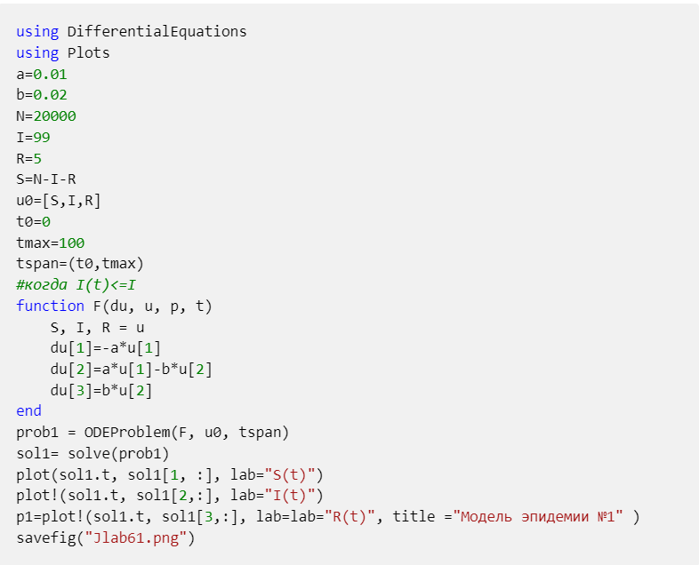
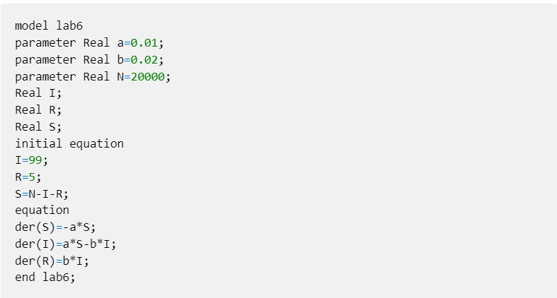
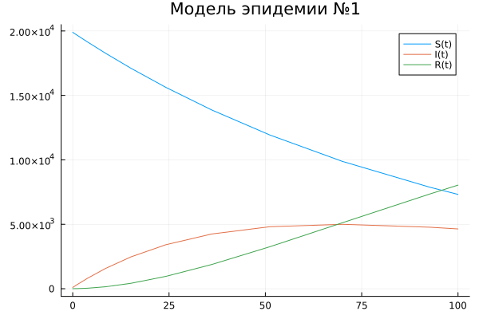
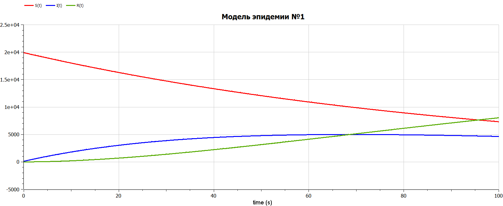
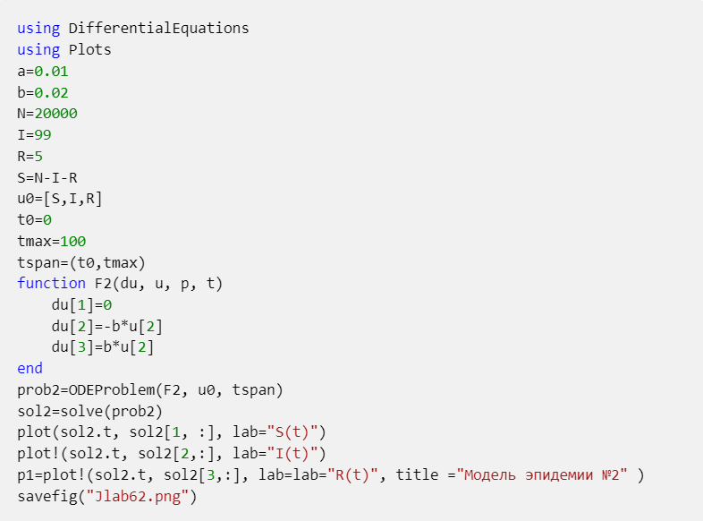
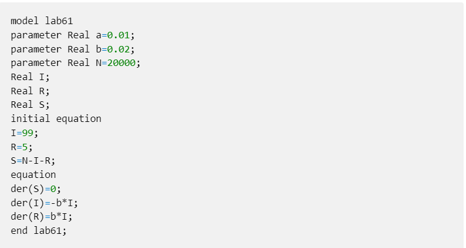
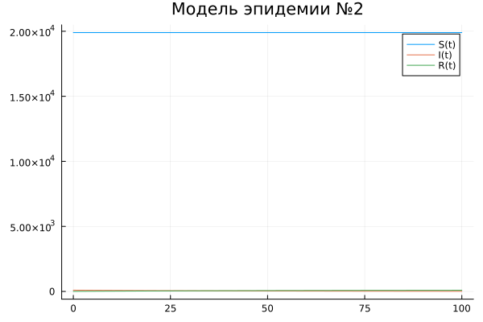
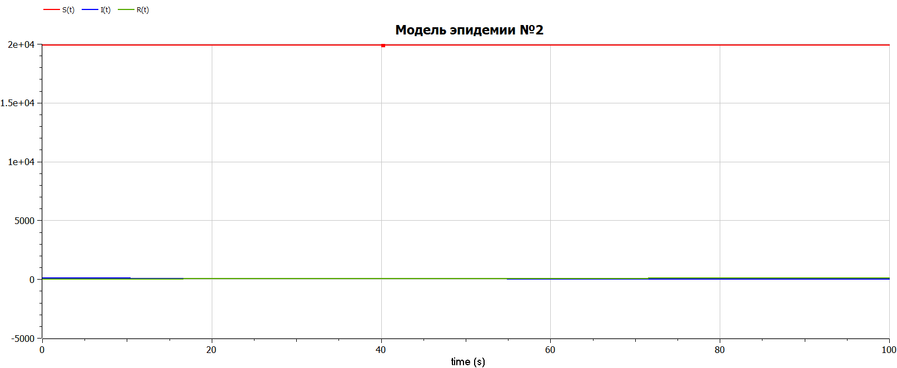

---
## Front matter
lang: ru-RU
title: Презентация по лабораторной работе № 6
subtitle: Математическое моделирование
author: Адебайо Р. А.
institute: Российский университет дружбы народов, Москва, Россия
date: 18 марта 2023
## i18n babel
babel-lang: russian
babel-otherlangs: english

## Formatting pdf
toc: false
toc-title: Содержание
slide_level: 2
aspectratio: 169
section-titles: true
theme: metropolis
header-includes:
 - \metroset{progressbar=frametitle,sectionpage=progressbar,numbering=fraction}
 - '\makeatletter'
 - '\beamer@ignorenonframefalse'
 - '\makeatother'
---

# Информация

## Докладчик

:::::::::::::: {.columns align=center}
::: {.column width="70%"}

* Адебайо Ридвануллахи Айофе
* студент группы НКНбд-01-20
* Факультет физико-математических и естественных наук
* Российский университет дружбы народов
* [Страничка на GitHub](https://github.com/PrinceKay145)
* [Страничка на LinkedIn](https://www.linkedin.com/in/ridwan-adebayo-0443a2231/)

:::
::::::::::::::

# Вводная часть

## Прагматика выполнения

* Познакомиться с моделью эпидемии

* Использование Julia и OpenModelica  для выполнения лабораторных работ

* Применение полученных знаний на практике в дальнейшем

## Цель работы

* Построить графики изменения числа особей в каждой из трех групп

* Отработать навыки решения систем дифференциальных уравнений на языке Julia, Openmodelica

# Ход работы

## Задание

На одном острове вспыхнула эпидемия. Известно, что из всех проживающих
на острове $(N=20 000)$ в момент начала эпидемии $(t=0)$ число заболевших людей (являющихся распространителями инфекции) $I(0)=99$, А число здоровых людей с иммунитетом к болезни $R(0)=5$. Таким образом, число людей восприимчивых к болезни, но пока здоровых, в начальный момент времени $S(0)=N-I(0)- R(0)$.

Постройте графики изменения числа особей в каждой из трех групп.

Рассмотрите, как будет протекать эпидемия в случае:

1. если $I(0) \leq I^*$

2. если $I(0) > I^*$

## Первый случай где $I(0) > I^*$

$$
\left\{
\begin{aligned}
&\frac{\mathrm{d}S}{\mathrm{d}t} = -\alpha S,\\
&\frac{\mathrm{d}I}{\mathrm{d}t} = \alpha S - \beta I,\\
&\frac{\mathrm{d}R}{\mathrm{d}t} = \beta I.
\end{aligned}
\right.
$$

## Решение на Julia

## Решение на OpenModelica

## Результаты

:::::::::::::: {.columns align=center}
::: {.column width="50%"}
{#fig:001 width=60%}
:::
::: {.column width="50%"}
{#fig:002 width=90%}
:::
::::::::::::::

## Второй случай где $I(0) \leq I^*$

$$
\left\{
\begin{aligned}
&\frac{\mathrm{d}S}{\mathrm{d}t} = 0,\\
&\frac{\mathrm{d}I}{\mathrm{d}t} =  - \beta I,\\
&\frac{\mathrm{d}R}{\mathrm{d}t} = \beta I.
\end{aligned}
\right.
$$

## Решение на Julia

## Решение на OpenModelica

## Результаты

:::::::::::::: {.columns align=center}
::: {.column width="50%"}
{#fig:003 width=60%}
:::
::: {.column width="50%"}
{#fig:004 width=90%}
:::
::::::::::::::

# Вывод

* Мы научились работать на Julia и на OpenModelica

* Познакомился с простейшей моделью эпидемии

* Научились строить графики

* Заметили, что при реализации на Julia и Openmodelica портреты совпадают

