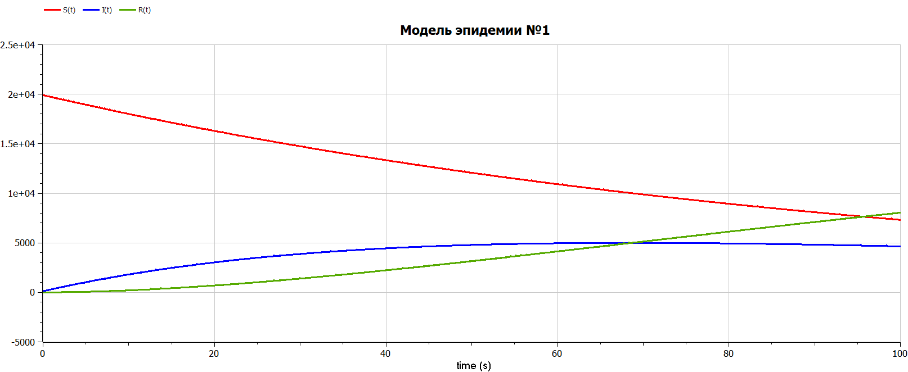
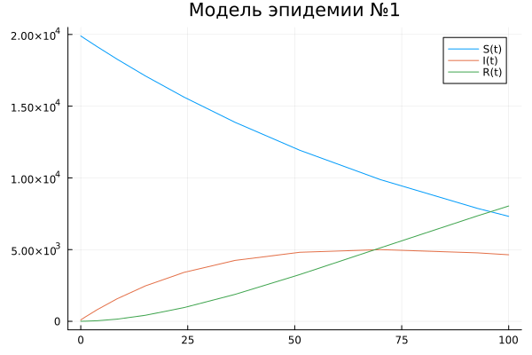
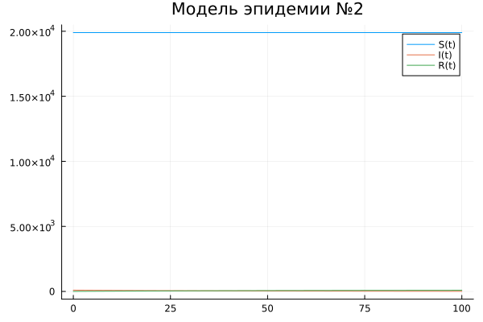

---
## Front matter
title: "Отчёта по лабораторной работе № 6"
subtitle: "Математическое моделирование"
author: "Адебайо Ридвануллахи Айофе"

## Generic otions
lang: ru-RU
toc-title: "Содержание"

## Bibliography
bibliography: bib/cite.bib
csl: pandoc/csl/gost-r-7-0-5-2008-numeric.csl

## Pdf output format
toc: true # Table of contents
toc-depth: 2
lof: true # List of figures
lot: true # List of tables
fontsize: 12pt
linestretch: 1.5
papersize: a4
documentclass: scrreprt
## I18n polyglossia
polyglossia-lang:
  name: russian
  options:
	- spelling=modern
	- babelshorthands=true
polyglossia-otherlangs:
  name: english
## I18n babel
babel-lang: russian
babel-otherlangs: english
## Fonts
mainfont: PT Serif
romanfont: PT Serif
sansfont: PT Sans
monofont: PT Mono
mainfontoptions: Ligatures=TeX
romanfontoptions: Ligatures=TeX
sansfontoptions: Ligatures=TeX,Scale=MatchLowercase
monofontoptions: Scale=MatchLowercase,Scale=0.9
## Biblatex
biblatex: true
biblio-style: "gost-numeric"
biblatexoptions:
  - parentracker=true
  - backend=biber
  - hyperref=auto
  - language=auto
  - autolang=other*
  - citestyle=gost-numeric
## Pandoc-crossref LaTeX customization
figureTitle: "Рис."
tableTitle: "Таблица"
listingTitle: "Листинг"
lofTitle: "Список иллюстраций"
lotTitle: "Список таблиц"
lolTitle: "Листинги"
## Misc options
indent: true
header-includes:
  - \usepackage{indentfirst}
  - \usepackage{float} # keep figures where there are in the text
  - \floatplacement{figure}{H} # keep figures where there are in the text
---

# Цель работы

Построить графики изменения числа особей в группах с помощью простейшей модели эпидемии, рассмотреть, как будет протекать эпидемия в различных случаях.

# Задание

На одном острове вспыхнула эпидемия. Известно, что из всех проживающих
на острове $(N=20 000)$ в момент начала эпидемии $(t=0)$ число заболевших людей (являющихся распространителями инфекции) $I(0)=99$, А число здоровых людей с иммунитетом к болезни $R(0)=5$. Таким образом, число людей восприимчивых к болезни, но пока здоровых, в начальный момент времени $S(0)=N-I(0)- R(0)$.

Постройте графики изменения числа особей в каждой из трех групп.

Рассмотрите, как будет протекать эпидемия в случае:

1. если $I(0)\leq I^*$

2. если $I(0) > I^*$

# Теоретическое введение

Рассмотрим простейшую модель эпидемии. Предположим, что некая популяция, состоящая из N особей, (считаем, что популяция изолирована) подразделяется на три группы. Первая группа - это восприимчивые к болезни, но пока здоровые особи, обозначим их через S(t). Вторая группа – это число инфицированных особей, которые также при этом являются распространителями инфекции, обозначим их I(t). А третья группа, обозначающаяся через R(t) – это здоровые особи с иммунитетом к болезни.

До того, как число заболевших не превышает критического значения $I^*$, считаем, что все больные изолированы и не заражают здоровых. Когда
$I(t) > I^*$, тогда инфицирование способны заражать восприимчивых к болезни особей.

Таким образом, скорость изменения числа $S(t)$ меняется по следующему
закону:

$$
\frac{\mathrm{d}S}{\mathrm{d}t} =
\left\{
\begin{aligned}
&-\alpha S,\ если \ I(t) > I^*\\
&0,\ если\ I(t) \leq I
\end{aligned}
\right.
$$

Поскольку каждая восприимчивая к болезни особь, которая, в конце концов, заболевает, сама становится инфекционной, то скорость изменения числа инфекционных особей представляет разность за единицу времени между заразившимися и теми, кто уже болеет и лечится, т.е.:

$$
\frac{\mathrm{d}I}{\mathrm{d}t} =
\left\{
\begin{aligned}
&\alpha S - \beta I,\ если \ I(t) > I^*\\
&-\beta I,\ если\ I(t) \leq I
\end{aligned}
\right.
$$

А скорость изменения выздоравливающих особей (при этом приобретающие
иммунитет к болезни)

$$
\frac{\mathrm{d}R}{\mathrm{d}t} = \beta I
$$

Постоянные пропорциональности $\alpha, \beta$ - это коэффициенты заболеваемости и выздоровления соответственно.

Для того, чтобы решения соответствующих уравнений определялось однозначно, необходимо задать начальные условия. Считаем, что на начало эпидемии в момент времени $t= 0$ нет особей с иммунитетом к болезни $R(0)=0$, а
число инфицированных и восприимчивых к болезни особей $I(0)$ и $S(0)$
соответственно. Для анализа картины протекания эпидемии необходимо рассмотреть два случая: $I(0) \leq I^*$ и $I(0) > I^*$

# Выполнение лабораторной работы

1. Первый случай где $I(0) > I^*$

$$
\left\{
\begin{aligned}
&\frac{\mathrm{d}S}{\mathrm{d}t} = -\alpha S,\\
&\frac{\mathrm{d}I}{\mathrm{d}t} = \alpha S - \beta I,\\
&\frac{\mathrm{d}R}{\mathrm{d}t} = \beta I.
\end{aligned}
\right.
$$

Code on OpenModelica

```M
model lab6
parameter Real a=0.01;
parameter Real b=0.02;
parameter Real N=20000;

Real I;
Real R;
Real S;
initial equation
I=99;
R=5;
S=N-I-R;

equation
der(S)=-a*S;
der(I)=a*S-b*I;
der(R)=b*I;
end lab6;
```

{ #fig:001 width=70% height=70% }

Code on Julia

```Julia
using DifferentialEquations
using Plots

a=0.01
b=0.02
N=20000
I=99
R=5
S=N-I-R
u0=[S,I,R]
t0=0
tmax=100
tspan=(t0,tmax)
#когда I(t)<=I
function F(du, u, p, t)
    S, I, R = u
    du[1]=-a*u[1]
    du[2]=a*u[1]-b*u[2]
    du[3]=b*u[2]
end
prob1 = ODEProblem(F, u0, tspan)
sol1= solve(prob1)

plot(sol1.t, sol1[1, :], lab="S(t)")
plot!(sol1.t, sol1[2,:], lab="I(t)")
p1=plot!(sol1.t, sol1[3,:], lab=lab="R(t)", title ="Модель эпидемии №1" )
savefig("Jlab61.png")
```

{ #fig:002 width=70% height=70% }

2. Второй случай где $I(0) \leq I^*$

$$
\left\{
\begin{aligned}
&\frac{\mathrm{d}S}{\mathrm{d}t} = 0,\\
&\frac{\mathrm{d}I}{\mathrm{d}t} =  - \beta I,\\
&\frac{\mathrm{d}R}{\mathrm{d}t} = \beta I.
\end{aligned}
\right.
$$

Code on OpenModelica

```M
model lab61
parameter Real a=0.01;
parameter Real b=0.02;
parameter Real N=20000;

Real I;
Real R;
Real S;
initial equation
I=99;
R=5;
S=N-I-R;

equation
der(S)=0;
der(I)=-b*I;
der(R)=b*I;
end lab61;
```

{ #fig:003 width=70% height=70% }

Code on Julia

```Julia
using DifferentialEquations
using Plots

a=0.01
b=0.02
N=20000
I=99
R=5
S=N-I-R
u0=[S,I,R]
t0=0
tmax=100
tspan=(t0,tmax)

function F2(du, u, p, t)
    du[1]=0
    du[2]=-b*u[2]
    du[3]=b*u[2]
end

prob2=ODEProblem(F2, u0, tspan)
sol2=solve(prob2)

plot(sol2.t, sol2[1, :], lab="S(t)")
plot!(sol2.t, sol2[2,:], lab="I(t)")
p1=plot!(sol2.t, sol2[3,:], lab=lab="R(t)", title ="Модель эпидемии №2" )
savefig("Jlab62.png")
```

{ #fig:004 width=70% height=70% }

# Выводы

В ходе выполнения лабораторной работы я научился строить графики изменения числа особей в группах с помощью простейшей модели эпидемии, рассмотрел, как будет протекать эпидемия в различных случаях.

# Список литературы

1. Кулябов Д. С.  *Лабораторная работа №6* : <https://esystem.rudn.ru/course/view.php?id=5930>

2. <https://math.meta.stackexchange.com/questions/21841/how-to-type-greater-than-or-equal-to-symbols>
