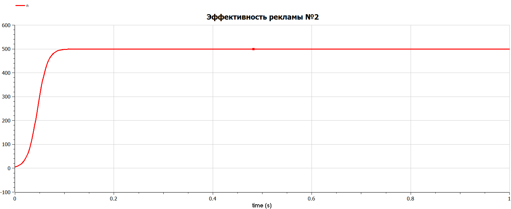

---
## Front matter
title: "Отчёта по лабораторной работе № 7"
subtitle: "Математическое моделирование"
author: "Адебайо Ридвануллахи Айофе"

## Generic otions
lang: ru-RU
toc-title: "Содержание"

## Bibliography
bibliography: bib/cite.bib
csl: pandoc/csl/gost-r-7-0-5-2008-numeric.csl

## Pdf output format
toc: true # Table of contents
toc-depth: 2
lof: true # List of figures
lot: true # List of tables
fontsize: 12pt
linestretch: 1.5
papersize: a4
documentclass: scrreprt
## I18n polyglossia
polyglossia-lang:
  name: russian
  options:
	- spelling=modern
	- babelshorthands=true
polyglossia-otherlangs:
  name: english
## I18n babel
babel-lang: russian
babel-otherlangs: english
## Fonts
mainfont: PT Serif
romanfont: PT Serif
sansfont: PT Sans
monofont: PT Mono
mainfontoptions: Ligatures=TeX
romanfontoptions: Ligatures=TeX
sansfontoptions: Ligatures=TeX,Scale=MatchLowercase
monofontoptions: Scale=MatchLowercase,Scale=0.9
## Biblatex
biblatex: true
biblio-style: "gost-numeric"
biblatexoptions:
  - parentracker=true
  - backend=biber
  - hyperref=auto
  - language=auto
  - autolang=other*
  - citestyle=gost-numeric
## Pandoc-crossref LaTeX customization
figureTitle: "Рис."
tableTitle: "Таблица"
listingTitle: "Листинг"
lofTitle: "Список иллюстраций"
lotTitle: "Список таблиц"
lolTitle: "Листинги"
## Misc options
indent: true
header-includes:
  - \usepackage{indentfirst}
  - \usepackage{float} # keep figures where there are in the text
  - \floatplacement{figure}{H} # keep figures where there are in the text
---

# Цель работы

* Рассмотреть простейшую модель эффективность рекламы.

* Построить модель и визуализировать и анализировать графики эффективности распространения рекламы для трех случаев.

* Визуализировать модель с помощью Julia и OpenModelica

# Задание

Постройте график распространения рекламы, математическая модель которой  описывается следующим уравнением:

1. $\frac{\mathrm{d}n}{\mathrm{d}t} = (0.55+0.0001n(t))(N-n(t))$

2. $\frac{\mathrm{d}n}{\mathrm{d}t} = (0.00005+0.2n(t))(N-n(t))$

3. $\frac{\mathrm{d}n}{\mathrm{d}t} = (0.05\sin(t)+0.3\cos(t)n(t))(N-n(t))$

При этом объем аудитории $N = 500$, в начальный момент о товаре знает 5 человек. Для случая 2 определите в какой момент времени скорость распространения рекламы будет иметь максимальное значение.

# Теоретическое введение

Организуется рекламная кампания нового товара или услуги. Необходимо, чтобы прибыль будущих продаж с избытком покрывала издержки на рекламу. Вначале расходы могут превышать прибыль, поскольку лишь малая часть потенциальных покупателей будет информирована о новинке. Затем, при увеличении числа продаж, возрастает и прибыль, и, наконец, наступит момент, когда рынок насытиться, и рекламировать товар станет бесполезным.

Предположим, что торговыми учреждениями реализуется некоторая продукция, о которой в момент времени $t$ из числа потенциальных покупателей $N$ знает лишь $n$ покупателей. Для ускорения сбыта продукции запускается реклама по радио, телевидению и других средств массовой информации. После запуска рекламной кампании информация о продукции начнет распространяться среди потенциальных покупателей путем общения друг с другом. Таким образом, после запуска рекламных объявлений скорость изменения числа знающих о продукции людей пропорциональна как числу знающих о товаре покупателей, так и числу покупателей о нем не знающих

Модель рекламной кампании описывается следующими величинами. Считаем, что $\frac{\mathrm{d}n}{\mathrm{d}t}$ - скорость изменения со временем числа потребителей, узнавших о товаре и готовых его купить, $t$ - время, рошедшее с начала рекламной кампании, n(t) - число уже информированных клиентов. Эта величина пропорциональна числу покупателей, еще не знающих о нем, это описывается следующим образом: $\alpha_1(t)(N-n(t))$, где $N$ - общее число потенциальных платежеспособных покупателей, $\alpha_1(t)>0$ - характеризует интенсивность рекламной кампании (зависит от затрат на рекламу в данный момент времени). Помимо этого, узнавшие о товаре потребители также распространяют полученную информацию среди потенциальных покупателей, не знающих о нем (в этом случае работает т.н. сарафанное радио). Этот вклад в рекламу описывается величиной $\alpha_2(t)n(t)(N-n(t))$, эта величина увеличивается с увеличением потребителей узнавших о товаре. Математическая модель распространения рекламы описывается уравнением:
$$\frac{\mathrm{d}n}{\mathrm{d}t} = (\alpha_1(t)+\alpha_2(t)n(t))(N-n(t))$$

При $\alpha_1(t) >> \alpha_2(t)$ получается модель типа модели Мальтуса, решение которой имеет вид'

{#fig:001 width=70% height=70% }

В обратном случае, при $\alpha_1(t) << \alpha_2(t)$  получаем уравнение логистической кривой:

{#fig:002 width=70% height=70%}

# Выполнение лабораторной работы

## Случай 1

 $\frac{\mathrm{d}n}{\mathrm{d}t} = (0.55+0.0001n(t))(N-n(t))$, где $\alpha_1 >> \alpha_2$

Code on Julia:

```julia
using DifferentialEquations
using Plots
N=500
n=5
u0=[n]
t0=0
tmax=30
tspan=(t0,tmax)
function F(du, u, p, t)
    du[1]=(0.55+0.0001*u[1])*(N-u[1])
end
prob=ODEProblem(F, u0, tspan)
sol=solve(prob)
plot(sol, title= "Эффективность рекламы №1", lab="n(t)", linewidth=2)
savefig("../report/image/JLab71.png")
```

{#fig:003 width=70% height=70%}

Code on Openmodelica:

```M
model lab7
parameter Real N=500;
Real n(start=5);
equation
der(n)= (0.55+0.0001*n) *(N-n);
end lab7;
```

{#fig:004 width=70% height=70%}

## Случай 2

$\frac{\mathrm{d}n}{\mathrm{d}t} = (0.00005+0.2n(t))(N-n(t))$, где $\alpha_1 << \alpha_2$

Code on Julia:

```julia
using DifferentialEquations
using Plots
N=500
n=5
u0=[n]
t0=0
tmax=1
tspan=(t0,tmax)
function F(du, u, p, t)
    du[1]=(0.00005+0.2*u[1])*(N-u[1])
end
prob=ODEProblem(F, u0, tspan)
sol=solve(prob)
plot(sol, title= "Эффективность рекламы №2", lab="n(t)", linewidth=2)
savefig("../report/image/JLab72.png")
```

{#fig:005 width=70% height=70%}

Code on Openmodelica:

```M
model lab7
parameter Real N=500;
Real n(start=5);
equation
der(n)= (0.00005+0.2*n) *(N-n);
end lab7;
```

{#fig:006 width=70% height=70%}

Максимальное значение n достигается при time=0.15.

При t>0.15 n(t) стремится к N.

## Случай 3

$\frac{\mathrm{d}n}{\mathrm{d}t} = (0.05\sin(t)+0.3\cos(t)n(t))(N-n(t))$, где $\alpha_1, \alpha_2$ - периодические функции

Code on Julia:

```julia
using DifferentialEquations
using Plots
N=500
n=5
u0=[n]
t0=0
tmax=1
tspan=(t0,tmax)
function F(du, u, p, t)
  du[1]=(0.5*sin(t)+0.3*cos(t)*u[1])*(N-u[1])
end
prob=ODEProblem(F, u0, tspan)
sol=solve(prob)
plot(sol, title= "Эффективность рекламы №3", lab="n(t)", linewidth=2)
savefig("../report/image/JLab73.png")
```

{#fig:007 width=70% height=70%}

Code on Openmodelica:

```M
model lab7
parameter Real N=500;
Real n(start=5);
equation
der(n)= (0.5 * sin(time)+0.3 * cos(time) * n) *(N-n);
end lab7;
```

{#fig:008 width=70% height=70%}

# Вопросы к лабораторной работе

1. Записать модель Мальтуса (дать пояснение, где используется данная модель).

$$\frac{\partial N}{\partial t}=rN$$

где $N$ — исходная численность населения, $r$ — коэффициент пропорциональности, для которого $r = b - d$ ($b$ — коэффициент рождаемости, $d$ — коэффициент смертности), $t$ — время.

Модель используется в экологии для расчета изменения популяции особей животных.

2. Записать уравнение логистической кривой (дать пояснение, что описывает данное уравнение)

$$ \frac{\partial P}{\partial t}=rP(1-\frac{P}{K}) $$

где r — характеризует скорость роста (размножения), K — поддерживающая ёмкость среды (то есть, максимально возможная численность популяции).

Исходные предположения для вывода уравнения при рассмотрении популяционной динамики выглядят следующим образом:

скорость размножения популяции пропорциональна её текущей численности, при прочих равных условиях;

скорость размножения популяции пропорциональна количеству доступных ресурсов, при прочих равных условиях. Таким образом, второй член уравнения отражает конкуренцию за ресурсы, которая ограничивает рост популяции.

3. На что влияет коэффициенты $\alpha_1(t)$ и $\alpha_2(t)$ в модели распространения рекламы.

$\alpha_1(t)$ — интенсивность рекламной кампании, зависящая от затрат.

$\alpha_2(t)$ — интенсивность рекламной кампании, зависящая от сарафанного радио.

4. Как ведет себя рассматриваемая модель при $\alpha_1(t)>>\alpha_2(t)$ 

При данный условиях получается модель типа модели Мальтуса, решение которой имеет вид:

{#fig:009 width=70% height=70%}

5. Как ведет себя рассматриваемая модель при $\alpha_1(t)<<\alpha_2(t)$

При данных условиях получаем уравнение логистической кривой:

{#fig:010 width=70% height=70%}

# Выводы

В ходе выполнения лабораторной работы я научился строить графики распространения рекламы, определять в какой момент времени скорость распространения рекламы будет иметь максимальное значение.

# Список литературы

1. Кулябов Д. С.  *Лабораторная работа №7* : <https://esystem.rudn.ru/course/view.php?id=5930>

2. Mango Office. (23 March 2023 г.). Mango Office. Получено из <https://www.mango-office.ru/products/calltracking/glossary/effektivnost-reklamy/>
