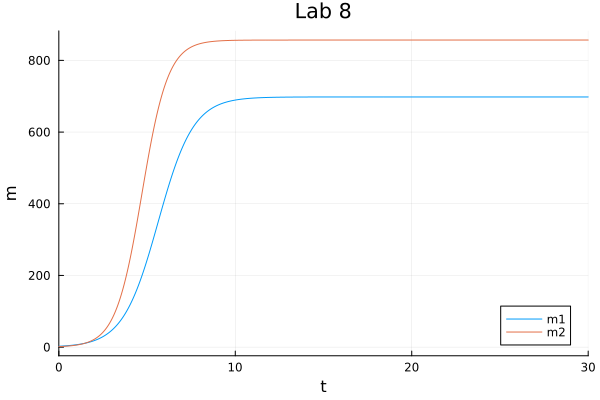
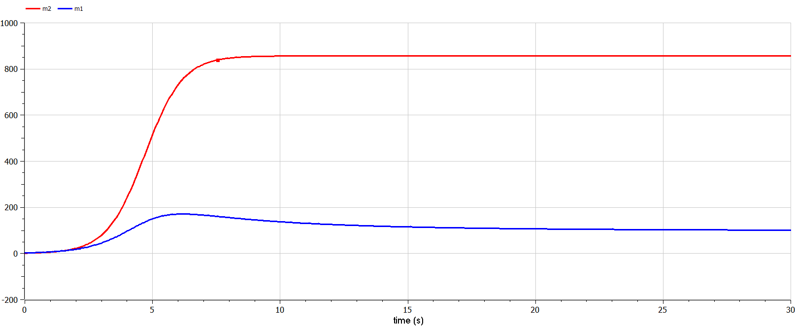

---
## Front matter
lang: ru-RU
title: Презентация по лабораторной работе № 8
subtitle: Математическое моделирование
author: Адебайо Р. А.
institute: Российский университет дружбы народов, Москва, Россия
date: 01 марта 2023
## i18n babel
babel-lang: russian
babel-otherlangs: english

## Formatting pdf
toc: false
toc-title: Содержание
slide_level: 2
aspectratio: 169
section-titles: true
theme: metropolis
header-includes:
 - \metroset{progressbar=frametitle,sectionpage=progressbar,numbering=fraction}
 - '\makeatletter'
 - '\beamer@ignorenonframefalse'
 - '\makeatother'
---

# Информация

## Докладчик

:::::::::::::: {.columns align=center}
::: {.column width="70%"}

* Адебайо Ридвануллахи Айофе
* студент группы НКНбд-01-20
* Факультет физико-математических и естественных наук
* Российский университет дружбы народов
* [Страничка на GitHub](https://github.com/PrinceKay145)
* [Страничка на LinkedIn](https://www.linkedin.com/in/ridwan-adebayo-0443a2231/)

:::
::::::::::::::

# Вводная часть

## Прагматика выполнения

* Рассмотреть модель конкуренции двух фирм

* Научиться строить графики изменения оборотных средств с помощью OpenModelica 

## Цель работы

* Рассмотреть две фирмы, производящие взаимозаменяемые товары одинакового качества и находящиеся в одной рыночной нише

* Рассмотреть модель, когда, помимо экономического фактора влияния, используются еще и социально-психологические факторы – формирование общественного предпочтения одного товара другому, не зависимо от их качества и цены

* Построить графики изменения оборотных средств фирмы 1 и фирмы 2 без учета постоянных издержек и с веденной нормировкой для случая 1

* Построить графики изменения оборотных средств фирмы 1 и фирмы 2 без учета постоянных издержек и с веденной нормировкой для случая 2

# Ход работы

## Задание 1

**Случай 1.**  В этом случае динамика изменения объемов продаж фирмы 1 и фирмы 2 описывается следующей системой уравнений:

$$
\left\{
\begin{aligned}
&\frac{\mathrm{d}M_1}{\mathrm{d}{\theta}} = M_1 - \frac{b}{c_1}M_1M_2 - \frac{a_1}{c_1} M_1^2,\\
&\frac{\mathrm{d}M_2}{\mathrm{d}{\theta}} = \frac{c_2}{c_1}M_2 - \frac{b}{c_1}M_1M_2 - \frac{a_2}{c_1} M_2^2.
\end{aligned}
\right.
$$

## Решение на OpenModelica

## Решение на Julia

## Результаты

:::::::::::::: {.columns align=center}
::: {.column width="50%"}
{#fig:001 width=60%}
:::
::: {.column width="50%"}
{#fig:002 width=90%}
:::
::::::::::::::

## Задание 2

**Случай 2.**  В этом случае взаимодействие двух фирм будет зависеть друг от друга, соответственно коэффициент перед $M_1 M_2$ будет отличаться. Пусть в рамках рассматриваемой модели динамика изменения объемов продаж фирмы 1 и фирмы 2 описывается следующей системой уравнений:

$$
\left\{
\begin{aligned}
&\frac{\mathrm{d}M_1}{\mathrm{d}{\theta}} = M_1 - (\frac{b}{c_1}+0,001)M_1M_2 - \frac{a_1}{c_1} M_1^2,\\
&\frac{\mathrm{d}M_2}{\mathrm{d}{\theta}} = \frac{c_2}{c_1}M_2 - \frac{b}{c_1}M_1M_2 - \frac{a_2}{c_1} M_2^2.
\end{aligned}
\right.
$$

где $a_1 = \frac{p_{cr}}{\tau_1^2 \tilde{p}_1^2Nq},
a_2=\frac{p_{cr}}{\tau_2^2 \tilde{p}_2^2Nq},
b= \frac{p_{cr}}{\tau_1^2 \tilde{p}_1^2 \tau_2^2 \tilde{p}_2^2Nq},
c_1=\frac{p_{cr} -\tilde{p}_1 }{\tau_1 \tilde{p}_1},
c_2 = \frac{p_{cr} -\tilde{p}_2}{\tau_2 \tilde{p}_2}.$

Также введена нормировка $t = c_1 \theta$.

1. Постройте графики изменения оборотных средств фирмы 1 и фирмы 2 без учета постоянных издержек и с веденной нормировкой для случая 1.

2. Постройте графики изменения оборотных средств фирмы 1 и фирмы 2 без учета постоянных издержек и с веденной нормировкой для случая 2.

## Решение на OpenModelica

## Решение на Julia

## Результаты

:::::::::::::: {.columns align=center}
::: {.column width="50%"}
{#fig:003 width=60%}
:::
::: {.column width="50%"}
{#fig:004 width=90%}
:::
::::::::::::::

# Вывод

В ходе выполнения лабораторной работы я рассмотрел модель конкуренции двух фирм. Построил графики изменения оборотных средств и проанализировала их.