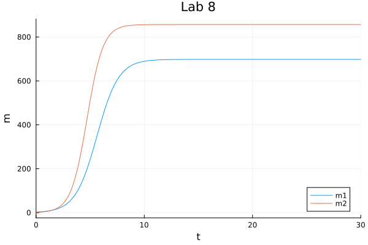
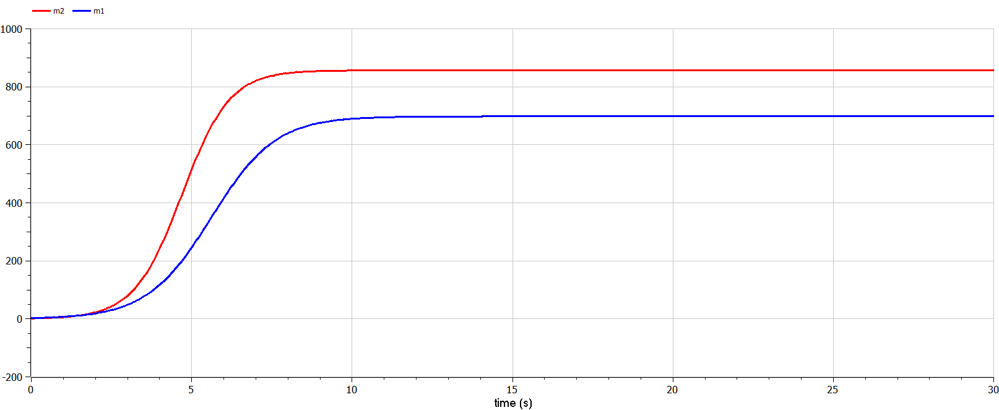
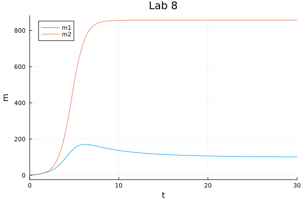
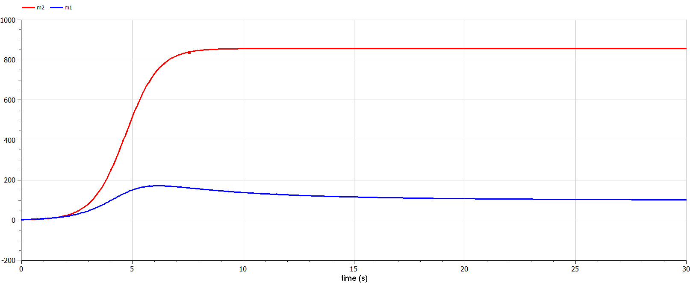

---
## Front matter
title: "Отчёта по лабораторной работе № 8"
subtitle: "Математическое моделирование"
author: "Адебайо Ридвануллахи Айофе"

## Generic otions
lang: ru-RU
toc-title: "Содержание"

## Bibliography
bibliography: bib/cite.bib
csl: pandoc/csl/gost-r-7-0-5-2008-numeric.csl

## Pdf output format
toc: true # Table of contents
toc-depth: 2
lof: true # List of figures
lot: true # List of tables
fontsize: 12pt
linestretch: 1.5
papersize: a4
documentclass: scrreprt
## I18n polyglossia
polyglossia-lang:
  name: russian
  options:
	- spelling=modern
	- babelshorthands=true
polyglossia-otherlangs:
  name: english
## I18n babel
babel-lang: russian
babel-otherlangs: english
## Fonts
mainfont: PT Serif
romanfont: PT Serif
sansfont: PT Sans
monofont: PT Mono
mainfontoptions: Ligatures=TeX
romanfontoptions: Ligatures=TeX
sansfontoptions: Ligatures=TeX,Scale=MatchLowercase
monofontoptions: Scale=MatchLowercase,Scale=0.9
## Biblatex
biblatex: true
biblio-style: "gost-numeric"
biblatexoptions:
  - parentracker=true
  - backend=biber
  - hyperref=auto
  - language=auto
  - autolang=other*
  - citestyle=gost-numeric
## Pandoc-crossref LaTeX customization
figureTitle: "Рис."
tableTitle: "Таблица"
listingTitle: "Листинг"
lofTitle: "Список иллюстраций"
lotTitle: "Список таблиц"
lolTitle: "Листинги"
## Misc options
indent: true
header-includes:
  - \usepackage{indentfirst}
  - \usepackage{float} # keep figures where there are in the text
  - \floatplacement{figure}{H} # keep figures where there are in the text
---

# Цель работы

* Рассмотреть простейшую модель эффективность рекламы.

* Построить модель и визуализировать и анализировать графики эффективности распространения рекламы для трех случаев.

* Визуализировать модель с помощью Julia и OpenModelica

# Задание

**Случай 1.** Рассмотрим две фирмы, производящие взаимозаменяемые товары одинакового качества и находящиеся в одной рыночной нише. Считаем, что в рамках нашей модели конкурентная борьба ведётся только рыночными методами. То есть, конкуренты могут влиять на противника путем изменения параметров своего производства: себестоимость, время цикла, но не могут прямо вмешиваться в ситуацию на рынке («назначать» цену или влиять на потребителей каким-либо иным способом.) Будем считать, что постоянные издержки пренебрежимо малы, и в модели учитывать не будем. В этом случае динамика изменения объемов продаж фирмы 1 и фирмы 2 описывается следующей системой уравнений:
$$
\left\{
\begin{aligned}
&\frac{\mathrm{d}M_1}{\mathrm{d}{\theta}} = M_1 - \frac{b}{c_1}M_1M_2 - \frac{a_1}{c_1} M_1^2,\\
&\frac{\mathrm{d}M_2}{\mathrm{d}{\theta}} = \frac{c_2}{c_1}M_2 - \frac{b}{c_1}M_1M_2 - \frac{a_2}{c_1} M_2^2.
\end{aligned}
\right.
$$

где $a_1 = \frac{p_{cr}}{\tau_1^2 \tilde{p}_1^2Nq},
a_2=\frac{p_{cr}}{\tau_2^2 \tilde{p}_2^2Nq},
b= \frac{p_{cr}}{\tau_1^2 \tilde{p}_1^2 \tau_2^2 \tilde{p}_2^2Nq},
c_1=\frac{p_{cr} -\tilde{p}_1 }{\tau_1 \tilde{p}_1},
c_2 = \frac{p_{cr} -\tilde{p}_2}{\tau_2 \tilde{p}_2}.$

Также введена нормировка $t = c_1 \theta$.

**Случай 2.** Рассмотрим модель, когда, помимо экономического фактора влияния (изменение себестоимости, производственного цикла, использование кредита и т.п.),  спользуются еще и социально-психологические факторы – формирование общественного предпочтения одного товара другому, не зависимо от их качества и цены. В этом случае взаимодействие двух фирм будет зависеть друг от друга, соответственно коэффициент перед $M_1 M_2$ будет отличаться. Пусть в рамках рассматриваемой модели динамика изменения объемов продаж фирмы 1 и фирмы 2 описывается следующей системой уравнений:

$$
\left\{
\begin{aligned}
&\frac{\mathrm{d}M_1}{\mathrm{d}{\theta}} = M_1 - (\frac{b}{c_1}+0,001)M_1M_2 - \frac{a_1}{c_1} M_1^2,\\
&\frac{\mathrm{d}M_2}{\mathrm{d}{\theta}} = \frac{c_2}{c_1}M_2 - \frac{b}{c_1}M_1M_2 - \frac{a_2}{c_1} M_2^2.
\end{aligned}
\right.
$$

Для обоих случаев рассмотрим задачу со следующими начальными условиями и параметрами:

$$
\begin{aligned}
&M_0^1 = 2.5, M_0^2=1.5,\\
&p_{cr}=15, N=17, q=1\\
&\tau_1=11, \tau_2=17,\\
&\tilde{p}_1=8, \tilde{p}_2=6
\end{aligned}
$$

**Замечание:** Значения $p_{cr}, \tilde{p}_{1,2}, N$ указаны в тысячах единиц, а значения $M_{1,2}$- указаны в млн. единиц.

**Обозначения:**

$N$ – число потребителей производимого продукта.

$\tau$ – длительность производственного цикла

$p$ – рыночная цена товара

$p̃$– себестоимость продукта, то есть переменные издержки на производство единицы продукции.
$q$ – максимальная потребность одного человека в продукте в единицу времени

$\theta = \frac{t}{c_1}$ - безразмерное время

1. Постройте графики изменения оборотных средств фирмы 1 и фирмы 2 без учета постоянных издержек и с веденной нормировкой для случая 1.

2. Постройте графики изменения оборотных средств фирмы 1 и фирмы 2 без учета постоянных издержек и с веденной нормировкой для случая 2.

# Теоретическое введение

**Модель одной фирмы**
Для построения модели конкуренции хотя бы двух фирм необходимо рассмотреть модель одной фирмы. Вначале рассмотрим модель фирмы, производящей продукт долговременного пользования, когда цена его определяется балансом спроса и предложения. Примем, что этот продукт занимает определенную нишу рынка и конкуренты в ней отсутствуют.

**Обозначим:**

N – число потребителей производимого продукта.

S – доходы потребителей данного продукта. Считаем, что доходы всех потребителей одинаковы. Это предположение справедливо, если речь идет об одной рыночной нише, т.е. производимый продукт ориентирован на определенный слой населения.

$M$ – оборотные средства предприятия

$\tau$ – длительность производственного цикла

$p$ – рыночная цена товара

$p̃$ – себестоимость продукта, то есть переменные издержки на производство единицы продукции.

$δ$ – доля оборотных средств, идущая на покрытие переменных издержек.

$κ$ – постоянные издержки, которые не зависят от количества выпускаемой продукции.

# Выполнение лабораторной работы

**Случай 1.**

Рассмотрим две фирмы, производящие взаимозаменяемые товары одинакового качества и находящиеся в одной рыночной нише. Считаем, что в рамках нашей модели конкурентная борьба ведётся только рыночными методами. То есть, конкуренты могут влиять на противника путем изменения параметров своего производства: себестоимость, время цикла, но не могут прямо вмешиваться в ситуацию на рынке («назначать» цену или влиять на потребителей каким-либо иным способом.) Будем считать, что постоянные издержки пренебрежимо малы, и в модели учитывать не будем. В этом случае динамика изменения объемов продаж фирмы 1 и фирмы 2 описывается следующей системой уравнений:

$$
\left\{
\begin{aligned}
&\frac{\mathrm{d}M_1}{\mathrm{d}{\theta}} = M_1 - \frac{b}{c_1}M_1M_2 - \frac{a_1}{c_1} M_1^2,\\
&\frac{\mathrm{d}M_2}{\mathrm{d}{\theta}} = \frac{c_2}{c_1}M_2 - \frac{b}{c_1}M_1M_2 - \frac{a_2}{c_1} M_2^2.
\end{aligned}
\right.
$$

Code on Julia:

```julia
using DifferentialEquations
using Plots
p_cr = 15
tau1= 11
tau2=14
p1=8
p2=6
q=1
N=17
d=0.001
M1=2.5
M2=1.5
u0=[M1, M2]
a1 = p_cr/(tau1*tau1*p1*p1*N*q)
a2 = p_cr/(tau2*tau2*p2*p2*N*q)
b = p_cr/(tau1*tau1*tau2*tau2*p1*p1*p2*p2*N*q)
c1 = (p_cr-p1)/(tau1*p1)
c2 = (p_cr-p2)/(tau2*p2)
function F(dm, m, p, t)
    dm[1]=m[1]-(b/c1)*m[1]*m[2]-(a1/c1)*m[1]*m[1]
    dm[2]=(c2/c1)*m[2]-(b/c1)*m[1]*m[2]-(a2/c1)*m[2]*m[2]
end
tspan = (0.0, 30.0)
prob = ODEProblem(F, u0, tspan)
sol = solve(prob, Tsit5(), reltol=1e-8, abstol=1e-8)
plot(
    sol, 
    title="Lab 8", 
    xlabel="t", 
    ylabel="m", 
    label=["m1" "m2"]
)
savefig("../report/image/Jlab81.png")
```

{#fig:001, width=70%, height=70%}

Code on OpenModelica:

```modelica
model lab8
parameter Real p_cr = 15;
parameter Real tau1= 11;
parameter Real tau2=14;
parameter Real p1=8;
parameter Real p2=6;
parameter Real q=1;
parameter Real N=17;


//initial equation
Real a1 = p_cr/(tau1*tau1*p1*p1*N*q);
Real a2 = p_cr/(tau2*tau2*p2*p2*N*q);
Real b = p_cr/(tau1*tau1*tau2*tau2*p1*p1*p2*p2*N*q);
Real c1 = (p_cr-p1)/(tau1*p1);
Real c2 = (p_cr-p2)/(tau2*p2);

Real m1(start=2.5);
Real m2(start=1.5);
equation
der(m1)=m1-(b/c1)*m1*m2-(a1/c1)*m1*m1;
der(m2)=(c2/c1)*m2-(b/c1)*m1*m2-(a2/c1)*m2*m2;
end lab8;
```



**Случай 2.**

Рассмотрим модель, когда, помимо экономического фактора влияния (изменение себестоимости, производственного цикла, использование кредита и т.п.),  спользуются еще и социально-психологические факторы – формирование общественного предпочтения одного товара другому, не зависимо от их качества и цены. В этом случае взаимодействие двух фирм будет зависеть друг от друга, соответственно коэффициент перед $M_1 M_2$ будет отличаться. Пусть в рамках рассматриваемой модели динамика изменения объемов продаж фирмы 1 и фирмы 2 описывается следующей системой уравнений:

$$
\left\{
\begin{aligned}
&\frac{\mathrm{d}M_1}{\mathrm{d}{\theta}} = M_1 - (\frac{b}{c_1}+0,001)M_1M_2 - \frac{a_1}{c_1} M_1^2,\\
&\frac{\mathrm{d}M_2}{\mathrm{d}{\theta}} = \frac{c_2}{c_1}M_2 - \frac{b}{c_1}M_1M_2 - \frac{a_2}{c_1} M_2^2.
\end{aligned}
\right.
$$

Code on Julia:

```julia
using DifferentialEquations
using Plots
p_cr = 15
tau1= 11
tau2=14
p1=8
p2=6
q=1
N=17

d=0.001
M1=2.5
M2=1.5
u0=[M1, M2]
a1 = p_cr/(tau1*tau1*p1*p1*N*q)
a2 = p_cr/(tau2*tau2*p2*p2*N*q)
b = p_cr/(tau1*tau1*tau2*tau2*p1*p1*p2*p2*N*q)
c1 = (p_cr-p1)/(tau1*p1)
c2 = (p_cr-p2)/(tau2*p2)
function F(dm, m, p, t)
    dm[1]=m[1]-((b/c1)+0.001)*m[1]*m[2]-(a1/c1)*m[1]*m[1]
    dm[2]=(c2/c1)*m[2]-(b/c1)*m[1]*m[2]-(a2/c1)*m[2]*m[2]
end
tspan = (0.0, 30.0)
prob = ODEProblem(F, u0, tspan)
sol = solve(prob, Tsit5(), reltol=1e-8, abstol=1e-8)
plot(
    sol, 
    title="Lab 8", 
    xlabel="t", 
    ylabel="m", 
    label=["m1" "m2"]
)
savefig("../report/image/Jlab82.png")
```



Code on OpenModelica:

```modelica
model lab8
parameter Real p_cr = 15;
parameter Real tau1= 11;
parameter Real tau2=14;
parameter Real p1=8;
parameter Real p2=6;
parameter Real q=1;
parameter Real N=17;
//initial equation
Real a1 = p_cr/(tau1*tau1*p1*p1*N*q);
Real a2 = p_cr/(tau2*tau2*p2*p2*N*q);
Real b = p_cr/(tau1*tau1*tau2*tau2*p1*p1*p2*p2*N*q);
Real c1 = (p_cr-p1)/(tau1*p1);
Real c2 = (p_cr-p2)/(tau2*p2);

Real m1(start=2.5);
Real m2(start=1.5);
equation
der(m1)=m1-((b/c1)+0.001)*m1*m2-(a1/c1)*m1*m1;
der(m2)=(c2/c1)*m2-(b/c1)*m1*m2-(a2/c1)*m2*m2;
end lab8;
```



# Выводы

В ходе выполнения лабораторной работы я рассмотрел модель конкуренции двух фирм. Построил графики изменения оборотных средств и проанализировала их. Я научился использовать язык программирования Julia и OpenModelica.

# Список литературы

1. Кулябов Д. С.  _Лабораторная работа №8_ : <https://esystem.rudn.ru/course/view.php?id=5930>
